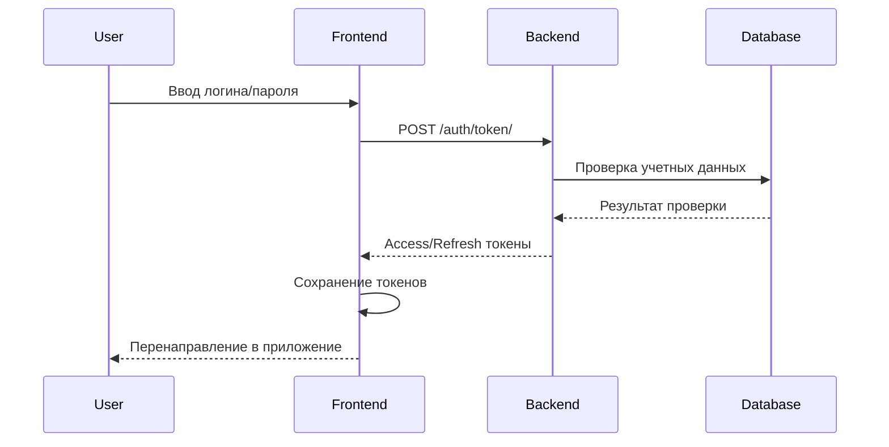
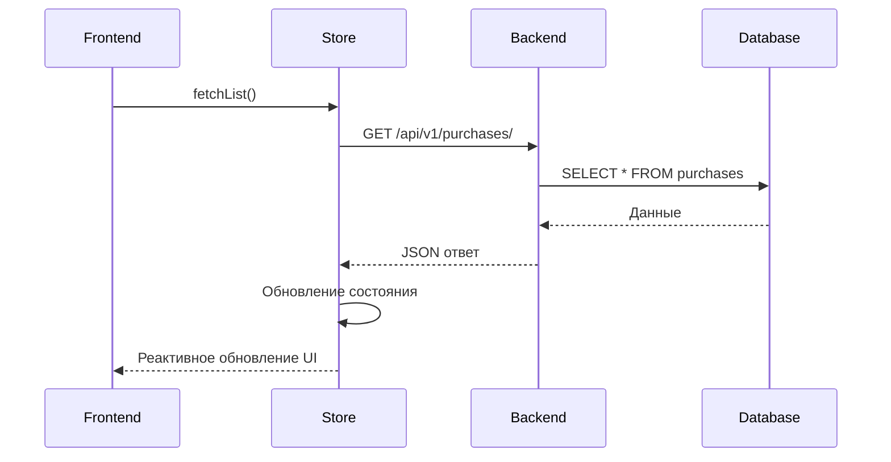
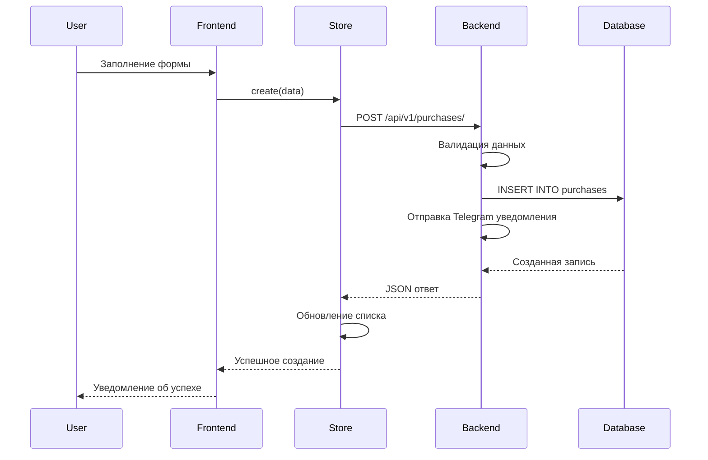

# Архитектура системы ELOM

## Обзор архитектуры

ELOM построен по принципу разделения на клиент-серверную архитектуру с четким разделением ответственности между backend и frontend компонентами.

## Backend архитектура (Django)

### Структура проекта
```
elom-backend/
├── elom/                    # Основные настройки Django
│   ├── settings.py         # Конфигурация приложения
│   ├── urls.py            # Главный URL роутер
│   └── wsgi.py            # WSGI конфигурация
├── common/                 # Общие модели и утилиты
├── users/                  # Управление пользователями
├── purchases/              # Модуль закупок
├── stock/                  # Управление остатками
├── reports/                # Отчеты
└── api_generators/         # Генераторы тестовых данных
```

### Основные компоненты

#### 1. Django REST Framework
- **ViewSets**: Предоставляют CRUD операции для всех моделей
- **Serializers**: Обрабатывают сериализацию/десериализацию данных
- **Permissions**: Контролируют доступ к ресурсам
- **Filters**: Обеспечивают фильтрацию и поиск

#### 2. Модели данных
- **User/Employee**: Управление пользователями и ролями
- **Object**: Строительные объекты
- **Material**: Материалы и их категории
- **Purchase**: Закупки и их элементы
- **PurchaseSupplier**: Поставщики для закупок
- **PurchasePhoto**: Фото закупок (instructions/report)
- **StockSnapshot**: Движения остатков
- **WriteOff**: Списания материалов
- **TelegramSettings**: Настройки Telegram бота
- **TelegramNotification**: Журнал уведомлений

#### 3. Система разрешений
```python
# Роли пользователей
ROLE_CHOICES = [
    ("admin", "Admin"),           # Полный доступ
    ("director", "Director"),     # Доступ ко всем объектам
    ("coordinator", "Coordinator"), # Назначенные объекты
    ("brigadier", "Brigadier"),   # Назначенные объекты
    ("buyer", "Buyer"),          # Назначенные объекты
    ("site_manager", "Site Manager"), # Назначенные объекты
]
```

#### 4. Сигналы Django
- **post_save/post_delete**: Автоматическое создание записей в журнале остатков
- **Telegram уведомления**: Отправка уведомлений при изменениях
- **Валидация**: Проверка бизнес-правил

## Frontend архитектура (Vue 3)

### Структура проекта
```
elom-frontend/
├── src/
│   ├── api/                # API клиент и типы
│   │   ├── types/          # Модульные типы TypeScript
│   │   │   ├── common.ts   # Общие типы
│   │   │   ├── auth.ts     # Аутентификация
│   │   │   ├── materials.ts # Материалы
│   │   │   ├── purchases.ts # Закупки
│   │   │   ├── reports.ts  # Отчеты
│   │   │   └── ...         # Другие модули
│   │   ├── client.ts       # HTTP клиент
│   │   ├── endpoints.ts    # API endpoints
│   │   └── types.ts        # Главный файл типов (реэкспорт)
│   ├── components/         # Переиспользуемые компоненты
│   ├── pages/             # Страницы приложения
│   ├── stores/            # Pinia stores (состояние)
│   ├── router/            # Vue Router конфигурация
│   ├── utils/             # Утилиты и хелперы
│   └── assets/            # Стили и статические ресурсы
├── docs/                  # Документация
└── e2e/                   # End-to-end тесты
```

### Основные компоненты

#### 1. Vue 3 Composition API
- **Reactive state**: Реактивное управление состоянием
- **Composables**: Переиспользуемая логика
- **TypeScript**: Строгая типизация

#### 2. Модульная система типов
```typescript
// Модульная структура типов
src/api/types/
├── common.ts        # Базовые типы (UserRole, Currency, PaginationParams)
├── auth.ts          # Аутентификация (LoginRequest, User, Me)
├── materials.ts     # Материалы (Material, MaterialRequest, MaterialFilterParams)
├── purchases.ts     # Закупки (Purchase, PurchaseItem, PurchaseCreateRequest)
├── reports.ts       # Отчеты (MaterialReportItem, ObjectReportRow)
├── stocks.ts        # Остатки (StockSnapshot, WriteOff, SmartQuantity)
├── objects.ts       # Объекты (SiteObject, ObjectRequest)
├── employees.ts     # Сотрудники (Employee, EmployeeCreateRequest)
├── suppliers.ts     # Поставщики (PurchaseSupplier, SupplierCreateRequest)
├── units.ts         # Единицы измерения (Unit, UnitRequest)
├── import.ts        # Импорт данных (ImportPrepareResponse, ImportCommitRequest)
├── archive.ts       # Архив (ArchivePeriod, ClosePeriodRequest)
├── notifications.ts # Уведомления (Notification)
├── audit.ts         # Аудит (AuditLog)
└── errors.ts        # Обработка ошибок (ApiError, ParsedApiError)

// Главный файл types.ts - реэкспортирует все модули
export * from './types/common';
export * from './types/auth';
// ... остальные модули
```

**Преимущества модульной структуры:**
- **Отсутствие дубликатов**: Каждый тип определен только в одном месте
- **Логическая группировка**: Типы сгруппированы по функциональности
- **Легкость поддержки**: Изменения в одном модуле не влияют на другие
- **Обратная совместимость**: Все существующие импорты продолжают работать

#### 3. Система роутинга
```typescript
// Основные маршруты
const routes = [
  { path: '/', redirect: '/purchases' },
  { path: '/purchases', component: PurchasesList },
  { path: '/materials', component: MaterialsList },
  { path: '/objects', component: ObjectsList },
  { path: '/stocks', component: StocksList },
  // ... другие маршруты
]
```

#### 4. Управление состоянием (Pinia)
```typescript
// Пример store
export const usePurchasesStore = defineStore('purchases', () => {
  const items = ref<Purchase[]>([])
  const loading = ref(false)
  const filters = ref<PurchaseFilterParams>({})
  
  const fetchList = async () => { /* ... */ }
  const create = async (data: PurchaseCreateRequest) => { /* ... */ }
  
  return { items, loading, filters, fetchList, create }
})

// SuppliersStore для управления поставщиками
export const useSuppliersStore = defineStore('suppliers', () => {
  const items = ref<PurchaseSupplier[]>([])
  const loading = ref(false)
  const filters = ref<SupplierFilterParams>({})
  
  const fetchList = async () => { /* ... */ }
  const create = async (data: SupplierCreateRequest) => { /* ... */ }
  const searchSuppliers = async (query: string) => { /* ... */ }
  
  return { items, loading, filters, fetchList, create, searchSuppliers }
})
```

**Доступные stores:**

#### Stores через createBaseStore (НЕ вызывать с `()`):
- **usePurchasesStore**: Управление закупками
- **useUnitsStore**: Управление единицами измерения
- **useObjectsStore**: Управление объектами
- **useEmployeesStore**: Управление сотрудниками
- **useWriteOffsStore**: Управление списаниями
- **useStockSnapshotsStore**: Управление движениями остатков

#### Stores через defineStore (вызывать с `()`):
- **useAuthStore**: Аутентификация и профиль пользователя
- **useMaterialsStore**: Управление материалами
- **useSuppliersStore**: Управление поставщиками
- **useMaterialCategoriesStore**: Управление категориями материалов
- **useThemeStore**: Управление темами
- **useNotificationsStore**: Уведомления
- **useUiStore**: UI состояние (темы, модальные окна)

#### 5. UI компоненты (48 файлов)

**Универсальные компоненты:**
- **GenericForm.vue**: Универсальная система форм с поддержкой 14 типов полей
- **GenericList.vue**: Универсальная система списков с фильтрацией и пагинацией
- **FormField.vue**: Атомарный компонент полей (14 типов: input, textarea, select, file, checkbox, switch, search, custom, etc.)
- **Modal.vue**: Модальные окна с размерами от sm до 7xl

**Специализированные компоненты:**
- **MaterialSearchSelect.vue**: Поиск материалов с автодополнением и debounce
- **SupplierSearchSelect.vue**: Поиск поставщиков с клавиатурной навигацией
- **FilterPanel.vue**: Панель фильтров с адаптивной сеткой
- **FilterField.vue**: Поля фильтров (10 типов)
- **ExportButton.vue**: Кнопка экспорта (CSV, Excel, PDF)
- **LoadingSpinner.vue**: Спиннер загрузки с 4 размерами и 5 вариантами
- **TableSkeleton.vue**: Скелетон таблицы с анимацией
- **ListHeader.vue**: Заголовок списка с статистикой

**Мобильные компоненты:**
- **MobileCard.vue**: Базовая мобильная карточка
- **MaterialCard.vue**: Карточка материала
- **PurchaseCard.vue**: Карточка закупки
- **AutoMobileNavigation.vue**: Автоматическая мобильная навигация
- **AutoNavigation.vue**: Автоматическая десктопная навигация

**Дизайн система:**
- **DaisyUI**: Основа для стилизации
- **Tailwind CSS v4**: Утилитарные стили
- **Адаптивный дизайн**: Поддержка мобильных устройств
- **Темная тема**: Переключение между светлой и темной темами
- **Кастомные поля**: Поддержка сложных компонентов через слоты
- **Мобильные карточки**: 8 специализированных карточек для мобильных устройств
- **Упрощение интерфейса**: Удалены неиспользуемые поля (НДС) для улучшения UX

## Взаимодействие компонентов

### 1. Аутентификация


### 2. Загрузка данных


### 3. Создание записи


## Технологический стек

### Backend
- **Django 4.2+**: Web framework
- **Django REST Framework**: API framework
- **PostgreSQL/SQLite**: База данных
- **Telegram Bot API**: Уведомления ✅
- **Celery**: Асинхронные задачи (планируется)
- **Redis**: Кэширование (планируется)

### Frontend
- **Vue 3.4+**: Frontend framework с Composition API
- **TypeScript 5.3+**: Строгая типизация
- **Pinia 2.1+**: Управление состоянием
- **Vue Router 4.2+**: Роутинг с middleware
- **Tailwind CSS v4**: Утилитарные стили
- **DaisyUI v5**: UI компоненты
- **Vite 5.0+**: Сборщик и dev сервер

### Инструменты разработки
- **ESLint 8.55+**: Линтинг кода
- **Prettier 3.1+**: Форматирование
- **Vitest 1.0+**: Unit тестирование
- **Vue Test Utils 2.4+**: Тестирование компонентов
- **Playwright 1.40+**: E2E тестирование
- **jsdom 23.0+**: DOM окружение для тестов
- **Docker**: Контейнеризация (планируется)

## Принципы архитектуры

### 1. Разделение ответственности
- **Backend**: Бизнес-логика, валидация, безопасность
- **Frontend**: UI/UX, пользовательский опыт
- **API**: Четкий контракт между компонентами

### 2. Масштабируемость
- **Модульная структура**: Легко добавлять новые функции
- **Микросервисная готовность**: Возможность разделения на сервисы
- **Кэширование**: Оптимизация производительности

### 3. Безопасность
- **JWT токены**: Безопасная аутентификация
- **Роли и разрешения**: Гранулярный контроль доступа
- **Валидация**: Проверка данных на всех уровнях
- **Telegram интеграция**: Безопасные уведомления через Bot API

### 4. Производительность
- **Ленивая загрузка**: Компоненты загружаются по требованию
- **Пагинация**: Обработка больших объемов данных
- **Оптимизация запросов**: Минимизация обращений к БД

## Следующие шаги

1. **Микросервисная архитектура**: Разделение на отдельные сервисы
2. **Кэширование**: Redis для кэширования часто используемых данных
3. **Мониторинг**: Интеграция с системами мониторинга
4. **CI/CD**: Автоматизация развертывания
5. **Контейнеризация**: Docker для всех компонентов

