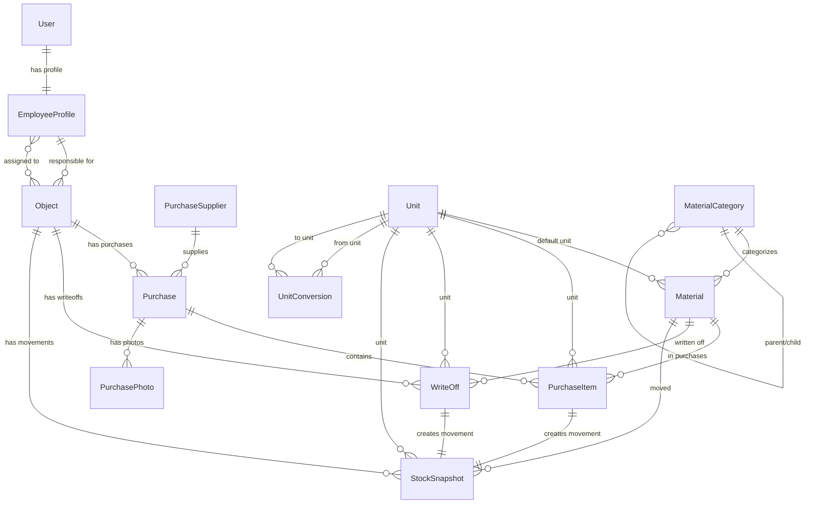

# Модели данных ELOM

## Обзор моделей

Система ELOM построена на основе Django ORM с четкой структурой моделей, отражающих бизнес-процессы управления строительными проектами.

## Базовые модели

### TimeStamped (Абстрактная)
```python
class TimeStamped(models.Model):
    created_at = models.DateTimeField(auto_now_add=True)
    updated_at = models.DateTimeField(auto_now=True)
    
    class Meta:
        abstract = True
```
**Назначение**: Базовый класс для всех моделей с автоматическим отслеживанием времени создания и обновления.

## Основные модели

### 1. User (Django Auth)
**Назначение**: Стандартная модель пользователей Django
**Связи**: OneToOne с EmployeeProfile

### 2. EmployeeProfile
```python
class EmployeeProfile(models.Model):
    # Роли системы (обновлено декабрь 2025)
    ROLE_CHOICES = [
        ("admin", "Администратор"),           # Полный доступ
        ("manager", "Управляющий"),           # Полный доступ без учета изменений
        ("brigadier", "Бригадир/Инженер"),    # Создание объекта, списание, закупка
        ("warehouse", "Склад/Цех/Проект"),    # Полный доступ без учета изменений
        ("requester", "Просмотр и подача заявки"),  # Просмотр и подача заявки
    ]
    
    user = models.OneToOneField(User, on_delete=models.CASCADE)
    role = models.CharField(max_length=32, choices=ROLE_CHOICES, default="brigadier")
    is_active = models.BooleanField(default=True)
    phone = models.CharField(max_length=32, blank=True)
    assigned_objects = models.ManyToManyField("common.Object", blank=True)
```

**Назначение**: Расширенный профиль пользователя с ролями и правами доступа
**Ключевые особенности**:
- Обязательный телефон для всех ролей кроме admin/manager
- Many-to-Many связь с объектами для ограничения доступа
- Метод `get_accessible_objects()` для определения доступных объектов
- Роли `manager` и `warehouse` работают "без учета изменений" - операции не создают StockSnapshot

### 3. Unit (Единицы измерения)
```python
class Unit(TimeStamped):
    code = models.CharField(max_length=16, unique=True)  # кг, м, шт
    name = models.CharField(max_length=64)               # килограмм, метр, штука
```

**Назначение**: Справочник единиц измерения
**Связи**: ForeignKey в Material.default_unit, UnitConversion

### 4. MaterialCategory (Категории материалов)
```python
class MaterialCategory(TimeStamped):
    name = models.CharField(max_length=128)
    parent = models.ForeignKey("self", null=True, blank=True, on_delete=models.SET_NULL)
```

**Назначение**: Иерархическая структура категорий материалов
**Связи**: ForeignKey в Material.category

### 5. Material (Материалы)
```python
class Material(TimeStamped):
    name = models.CharField(max_length=256)
    sku = models.CharField(max_length=64, blank=True, unique=True, null=True)
    category = models.ForeignKey(MaterialCategory, null=True, blank=True)
    default_unit = models.ForeignKey(Unit, on_delete=models.PROTECT)
    photo = models.ImageField(upload_to="materials/%Y/%m/", null=True, blank=True)
    
    # Расширенные поля
    is_active = models.BooleanField(default=True)
    created_date = models.DateField(null=True, blank=True)
    description = models.TextField(blank=True, default="")
    manufacturer = models.CharField(max_length=128, blank=True, default="")
    average_price = models.DecimalField(max_digits=10, decimal_places=2, null=True, blank=True)
```

**Назначение**: Справочник материалов с расширенной информацией
**Связи**: ForeignKey в PurchaseItem, WriteOff, StockSnapshot

### 6. Object (Строительные объекты)
```python
class Object(TimeStamped):
    name = models.CharField(max_length=128)
    address = models.CharField(max_length=256, blank=True, default="")
    is_active = models.BooleanField(default=True)
    
    # Обязательные поля согласно ТЗ
    responsible = models.ForeignKey("users.EmployeeProfile", on_delete=models.PROTECT)
    key_person_name = models.CharField(max_length=128, default="Не указано")
    key_person_contacts = models.TextField(default="Не указано")
    date_start = models.DateField(auto_now_add=True)
    
    # Опциональные поля
    date_end = models.DateField(null=True, blank=True)
    lat = models.DecimalField(max_digits=10, decimal_places=7, null=True, blank=True)
    lng = models.DecimalField(max_digits=10, decimal_places=7, null=True, blank=True)
    location_url = models.CharField(max_length=256, blank=True, default="")
```

**Назначение**: Строительные объекты с обязательными полями
**Валидация**: Ответственный должен иметь роль 'brigadier'
**Связи**: ForeignKey в Purchase, WriteOff, StockSnapshot

## Модели закупок

### 7. PurchaseSupplier (Поставщики)
```python
class PurchaseSupplier(TimeStamped):
    name = models.CharField(max_length=256, unique=True)
    contact_person = models.CharField(max_length=128, blank=True)
    phone = models.CharField(max_length=32, blank=True)
    email = models.EmailField(blank=True)
    address = models.TextField(blank=True)
    is_active = models.BooleanField(default=True)
```

**Назначение**: Справочник поставщиков
**Связи**: ForeignKey в Purchase

### 8. Purchase (Закупки)
```python
class Purchase(TimeStamped):
    STATUS_CHOICES = [
        ("new", "Новая"),
        ("completed", "Выполнено"),
        ("cancelled", "Отмена"),
    ]
    
    date = models.DateField()
    object = models.ForeignKey(Object, on_delete=models.PROTECT)
    supplier = models.ForeignKey(PurchaseSupplier, on_delete=models.PROTECT)
    invoice_number = models.CharField(max_length=64, blank=True, default="")
    currency = models.CharField(max_length=3, default="UZS")
    comment = models.TextField(blank=True, default="")
    responsible = models.ForeignKey(User, on_delete=models.PROTECT)
    total_amount = models.DecimalField(max_digits=18, decimal_places=2, default=Decimal("0.00"))
    is_archived = models.BooleanField(default=False)
    cover_photo = models.ImageField(upload_to="purchases/%Y/%m/", null=True, blank=True)
    status = models.CharField(max_length=20, choices=STATUS_CHOICES, default="new")
    purchase_no = models.CharField(max_length=64, blank=True, default="")
```

**Назначение**: Основная модель закупок
**Валидация**: 
- Ответственный должен быть бригадиром
- При статусе "completed" обязательны фото отчета
- Уникальный номер закупки в пределах ответственного
**Связи**: ForeignKey в PurchaseItem, PurchasePhoto

### 9. PurchaseItem (Элементы закупки)
```python
class PurchaseItem(TimeStamped):
    purchase = models.ForeignKey(Purchase, on_delete=models.CASCADE, related_name="items")
    material = models.ForeignKey(Material, on_delete=models.SET_NULL, null=True, blank=True)
    unit = models.ForeignKey(Unit, on_delete=models.PROTECT)
    quantity = models.DecimalField(max_digits=18, decimal_places=3, validators=[MinValueValidator(Decimal("0.001"))])
    price = models.DecimalField(max_digits=18, decimal_places=2, default=Decimal("0.00"), help_text="Цена за единицу")
    amount = models.DecimalField(max_digits=18, decimal_places=2, default=Decimal("0.00"), help_text="Общая сумма (quantity * price)")

    def save(self, *args, **kwargs):
        # Автоматически рассчитываем amount = quantity * price
        if self.quantity and self.price:
            self.amount = self.quantity * self.price
        super().save(*args, **kwargs)
```

**Назначение**: Детализация закупки по материалам
**Ключевые особенности**:
- Поле `price` - цена за единицу материала
- Поле `amount` - общая сумма (рассчитывается автоматически как `quantity * price`)
- Автоматический расчет суммы при сохранении
- Валидация минимального количества (0.001)
**Связи**: ForeignKey в StockSnapshot (source_type="purchase_item")

### 10. PurchasePhoto (Фото закупок)
```python
class PurchasePhoto(TimeStamped):
    purchase = models.ForeignKey(Purchase, on_delete=models.CASCADE, related_name="photos")
    photo = models.ImageField(upload_to="purchases/%Y/%m/")
    is_cover = models.BooleanField(default=False)
    type = models.CharField(max_length=20, choices=[
        ("general", "Общие"),
        ("instructions", "Инструкции"),
        ("report", "Отчет"),
    ], default="general")
```

**Назначение**: Фотографии к закупкам с типизацией
**Валидация**: При статусе "completed" обязательны фото типа "report"

## Модели остатков

### 11. WriteOff (Списания)
```python
class WriteOff(models.Model):
    STAGE_CHOICES = [
        ("acceptance", "Acceptance"),
        ("request", "Request"),
        ("delivery_fixed", "Delivery Fixed"),
        ("post_rough", "Post Rough"),
        ("handover", "Handover"),
    ]
    
    date = models.DateField()
    object = models.ForeignKey(Object, on_delete=models.PROTECT)
    material = models.ForeignKey(Material, on_delete=models.SET_NULL, null=True, blank=True)
    unit = models.ForeignKey(Unit, on_delete=models.PROTECT)
    quantity = models.DecimalField(max_digits=18, decimal_places=6)
    stage = models.CharField(max_length=32, choices=STAGE_CHOICES)
    responsible = models.ForeignKey(User, on_delete=models.PROTECT)
    comment = models.TextField(blank=True, default="")
    is_archived = models.BooleanField(default=False)
```

**Назначение**: Списания материалов с привязкой к этапам работ
**Ключевые особенности**:
- Автоматическое создание записей в журнале движений (StockSnapshot)
- Валидация материала может быть null для общих списаний
- Отображение актуального остатка через API endpoint `/stock/snapshots/balance/`
- Упрощенная валидация без системы предупреждений
**Связи**: ForeignKey в StockSnapshot (source_type="writeoff")

### 12. StockSnapshot (Журнал движений)
```python
class StockSnapshot(models.Model):
    STAGE_CHOICES = [
        ("acceptance", "Acceptance"),
        ("request", "Request"),
        ("delivery_fixed", "Delivery Fixed"),
        ("post_rough", "Post Rough"),
        ("handover", "Handover"),
    ]
    
    SOURCE_TYPE_CHOICES = [
        ("purchase_item", "Purchase Item"),
        ("writeoff", "Write Off"),
    ]
    
    date = models.DateField()
    object = models.ForeignKey(Object, on_delete=models.PROTECT)
    material = models.ForeignKey(Material, on_delete=models.PROTECT)
    unit = models.ForeignKey(Unit, on_delete=models.PROTECT)
    quantity_signed = models.DecimalField(max_digits=18, decimal_places=6)  # + для прихода, - для расхода
    stage = models.CharField(max_length=32, choices=STAGE_CHOICES)
    source_type = models.CharField(max_length=32, choices=SOURCE_TYPE_CHOICES)
    source_id = models.PositiveIntegerField()
    responsible = models.ForeignKey(User, on_delete=models.PROTECT)
    comment = models.TextField(blank=True, default="")
    is_archived = models.BooleanField(default=False)
```

**Назначение**: Центральный журнал всех движений материалов (Unified Ledger)
**Ключевые особенности**:
- `quantity_signed`: положительные значения для приходов, отрицательные для расходов
- `source_type` + `source_id`: ссылка на источник движения
- Автоматическое создание записей через сигналы Django

## Вспомогательные модели

### 13. UnitConversion (Конверсия единиц)
```python
class UnitConversion(models.Model):
    from_unit = models.ForeignKey(Unit, on_delete=models.PROTECT, related_name="conv_from")
    to_unit = models.ForeignKey(Unit, on_delete=models.PROTECT, related_name="conv_to")
    factor = models.DecimalField(max_digits=18, decimal_places=6)
    
    class Meta:
        unique_together = ("from_unit", "to_unit")
```

**Назначение**: Линейная конверсия между единицами измерения
**Формула**: `to_value = from_value * factor`

### 14. AuditLog (Журнал аудита)
```python
class AuditLog(models.Model):
    ts = models.DateTimeField(auto_now_add=True)
    user = models.ForeignKey(User, null=True, blank=True, on_delete=models.SET_NULL)
    action = models.CharField(max_length=32)
    model = models.CharField(max_length=64)
    object_id = models.CharField(max_length=64)
    detail = models.TextField(blank=True, default="")
    ip = models.GenericIPAddressField(null=True, blank=True)
```

**Назначение**: Логирование всех действий пользователей

### 15. TelegramSettings (Настройки Telegram)
```python
class TelegramSettings(models.Model):
    bot_token = models.CharField(max_length=256)
    chat_id = models.CharField(max_length=64)
    is_active = models.BooleanField(default=True)
    created_at = models.DateTimeField(auto_now_add=True)
```

**Назначение**: Настройки для отправки уведомлений в Telegram

### 16. TelegramNotification (Уведомления Telegram)
```python
class TelegramNotification(models.Model):
    purchase = models.ForeignKey(Purchase, on_delete=models.CASCADE, null=True, blank=True)
    object = models.ForeignKey(Object, on_delete=models.CASCADE, null=True, blank=True)
    message = models.TextField()
    sent_at = models.DateTimeField(auto_now_add=True)
    status = models.CharField(max_length=20, choices=[
        ("pending", "Ожидает"),
        ("sent", "Отправлено"),
        ("failed", "Ошибка"),
    ], default="pending")
```

**Назначение**: Логирование отправленных Telegram уведомлений

### 17. MaterialRequest (Заявки на материалы)
```python
class MaterialRequest(TimeStamped):
    STATUS_CHOICES = [
        ("pending", "Ожидает"),
        ("approved", "Одобрено"),
        ("rejected", "Отклонено"),
        ("fulfilled", "Выполнено"),
    ]
    
    date = models.DateField()
    object = models.ForeignKey(Object, on_delete=models.PROTECT)
    material = models.ForeignKey(Material, on_delete=models.PROTECT)
    unit = models.ForeignKey(Unit, on_delete=models.PROTECT)
    quantity = models.DecimalField(max_digits=18, decimal_places=6)
    requested_by = models.ForeignKey(User, on_delete=models.PROTECT, related_name='material_requests')
    status = models.CharField(max_length=20, choices=STATUS_CHOICES, default='pending')
    comment = models.TextField(blank=True, default="")
    approved_by = models.ForeignKey(User, on_delete=models.SET_NULL, null=True, blank=True, related_name='approved_requests')
    approved_at = models.DateTimeField(null=True, blank=True)
    rejection_reason = models.TextField(blank=True, default="")
```

**Назначение**: Система заявок на материалы для объектов
**Ключевые особенности**:
- Позволяет пользователям запрашивать материалы
- Статусы: ожидает, одобрено, отклонено, выполнено
- Связь с объектом, материалом, количеством
- Отслеживание кто подал заявку и кто одобрил

## Связи между моделями

### Диаграмма связей


## Бизнес-правила и валидация

### 1. Роли и доступ (обновлено декабрь 2025)
- **Admin**: Администратор (полный доступ)
- **Manager**: Управляющий (полный доступ без учета изменений)
- **Brigadier**: Бригадир/Инженер (создание объекта, списание, закупка)
- **Warehouse**: Склад/Цех/Проект (полный доступ без учета изменений)
- **Requester**: Просмотр и подача заявки на материал

> **Примечание:** Роли `director`, `coordinator`, `buyer`, `site_manager` удалены или заменены новыми ролями

**Особенности ролей без учета изменений:**
- Роли `manager` и `warehouse` могут создавать закупки и списания
- НО: эти операции НЕ создают записи в StockSnapshot
- Это позволяет планировать и документировать операции без изменения фактических остатков

### 2. Валидация закупок
- Ответственный за закупку должен быть бригадиром
- При статусе "completed" обязательны фото отчета
- Номер закупки уникален в пределах ответственного

### 3. Валидация списаний
- Проверка достаточности остатков
- Запрет отрицательных остатков для определенных ролей/этапов
- Конверсия единиц измерения

### 4. Unified Ledger Model
- Все движения материалов фиксируются в StockSnapshot
- Автоматическое создание записей при операциях с PurchaseItem и WriteOff
- Поддержка конверсии единиц измерения

## Индексы и производительность

### Ключевые индексы
```python
# Material
models.Index(fields=["is_active"])
models.Index(fields=["category", "is_active"])

# Object
models.Index(fields=["is_active"])
models.Index(fields=["date_start"])

# Purchase
models.Index(fields=["purchase_no"])
models.Index(fields=["responsible", "purchase_no"])

# StockSnapshot
models.Index(fields=["object", "material", "date"])
models.Index(fields=["source_type", "source_id"])
```

## Миграции

### Порядок применения миграций
1. **common**: Базовые модели (Unit, MaterialCategory, Material, Object)
2. **users**: EmployeeProfile
3. **purchases**: PurchaseSupplier, Purchase, PurchaseItem, PurchasePhoto
   - **0009_purchaseitem_price_alter_purchaseitem_amount**: Добавление поля `price` в модель PurchaseItem
4. **stock**: WriteOff, StockSnapshot
5. **reports**: Модели отчетов (если есть)

### Особенности миграций
- Использование `null=True` для обязательных полей при добавлении
- Постепенное добавление валидации через `clean()` методы
- Создание индексов для оптимизации запросов

## Расширение моделей

### Реализованные дополнения
1. **Архивные периоды**: Модель `ArchivePeriod` для закрытия периодов ✅
   ```python
   class ArchivePeriod(models.Model):
       month = models.DateField()  # Первое число месяца
       object = models.ForeignKey(Object, on_delete=models.PROTECT)
       closed_at = models.DateTimeField(auto_now_add=True)
       closed_by = models.ForeignKey(User, on_delete=models.PROTECT)
       
       class Meta:
           unique_together = ("month", "object")
   ```
2. **Аудит**: Расширенное логирование изменений ✅

### Планируемые дополнения
1. **Уведомления**: Система внутренних уведомлений
2. **Отчеты**: Модели для кэширования отчетов
3. **Интеграции**: Модели для внешних интеграций

