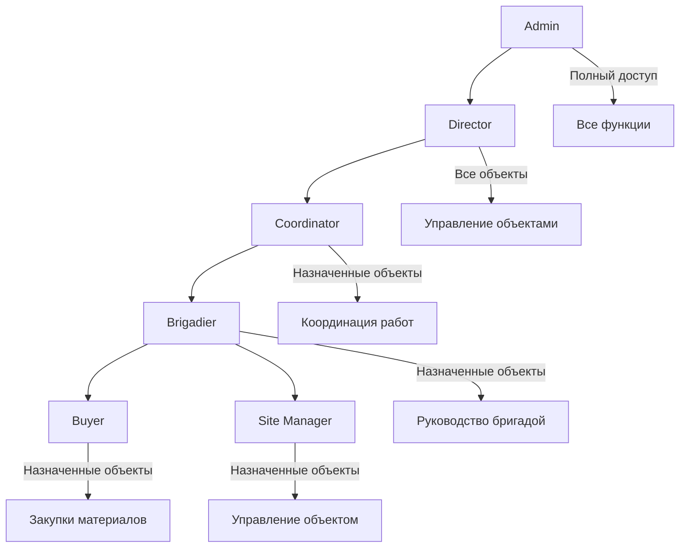
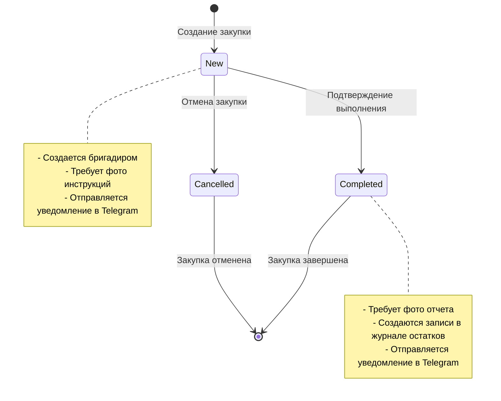

# Бизнес-логика ELOM

## Обзор бизнес-процессов

ELOM реализует комплексную систему управления строительными проектами с акцентом на контроль закупок, остатков материалов и отчетности. Система построена на принципах ролевой модели доступа и автоматизации бизнес-процессов.

## Роли пользователей и права доступа

### Иерархия ролей



### Детальное описание ролей

#### 1. Admin (Администратор)
**Права доступа:**
- Полный доступ ко всем данным и функциям
- Управление пользователями и ролями
- Настройка системы
- Доступ к административной панели Django

**Ограничения:**
- Нет ограничений по объектам
- Может изменять любые данные

**Бизнес-функции:**
- Создание и управление пользователями
- Настройка системы уведомлений
- Управление справочниками
- Доступ к аудиту системы

#### 2. Director (Директор)
**Права доступа:**
- Доступ ко всем объектам
- Просмотр всех закупок и остатков
- Управление отчетами
- Назначение ответственных

**Ограничения:**
- Не может изменять системные настройки
- Не может управлять пользователями

**Бизнес-функции:**
- Стратегическое планирование
- Контроль выполнения проектов
- Анализ эффективности закупок
- Принятие решений по объектам

#### 3. Coordinator (Координатор)
**Права доступа:**
- Доступ к назначенным объектам
- Координация между бригадами
- Просмотр отчетов по объектам
- Управление расписанием работ

**Ограничения:**
- Только назначенные объекты
- Не может создавать закупки

**Бизнес-функции:**
- Планирование работ
- Координация между подрядчиками
- Контроль выполнения планов
- Отчетность перед руководством

#### 4. Brigadier (Бригадир)
**Права доступа:**
- Доступ к назначенным объектам
- Создание и управление закупками
- Управление списаниями материалов
- Ответственность за объекты

**Ограничения:**
- Только назначенные объекты
- Не может изменять системные настройки

**Бизнес-функции:**
- Планирование закупок материалов
- Контроль остатков на объекте
- Управление бригадой
- Отчетность о выполнении работ

#### 5. Buyer (Покупатель)
**Права доступа:**
- Доступ к назначенным объектам
- Создание закупок
- Просмотр остатков материалов
- Работа с поставщиками

**Ограничения:**
- Только назначенные объекты
- Не может управлять списаниями
- Не может быть ответственным за объекты

**Бизнес-функции:**
- Поиск и выбор поставщиков
- Создание заявок на закупку
- Контроль качества материалов
- Ведение переговоров с поставщиками

#### 6. Site Manager (Менеджер объекта)
**Права доступа:**
- Доступ к назначенным объектам
- Просмотр закупок и остатков
- Управление списаниями
- Контроль выполнения работ

**Ограничения:**
- Только назначенные объекты
- Не может создавать закупки
- Не может быть ответственным за объекты

**Бизнес-функции:**
- Контроль выполнения работ
- Управление ресурсами объекта
- Отчетность о прогрессе
- Контроль качества работ

## Object-Scope ограничения

### Принцип работы
```python
def get_accessible_objects(self):
    """Получить объекты, к которым есть доступ"""
    if self.role in ("director", "admin", "coordinator"):
        # Полный доступ ко всем объектам
        return Object.objects.filter(is_active=True)
    else:
        # Доступ только к закрепленным объектам
        return self.assigned_objects.filter(is_active=True)
```

### Практическое применение
- **Admin/Director**: Видят все объекты в системе
- **Coordinator**: Видят все объекты для координации
- **Brigadier/Buyer/Site Manager**: Видят только назначенные объекты

## Workflow закупок

### Жизненный цикл закупки



### Бизнес-правила закупок

#### 1. Создание закупки
**Кто может создавать:**
- Только пользователи с ролью `brigadier`
- Ответственный должен быть назначен на объект

**Обязательные поля:**
- Дата закупки
- Объект (с проверкой доступа)
- Поставщик
- Ответственный (только бригадир)
- Элементы закупки (материалы, количества, цены)

**Автоматические действия:**
- Генерация номера закупки (уникальный в пределах ответственного)
- Расчет общей суммы
- Отправка уведомления в Telegram
- Создание записей в журнале аудита

#### 2. Статусы закупок
**New (Новая):**
- Статус по умолчанию при создании
- Можно редактировать все поля
- Требует фото инструкций (опционально)

**Completed (Выполнено):**
- Устанавливается после получения материалов
- **Обязательно** требуются фото отчета
- Создаются записи в журнале остатков
- Закупка становится неизменяемой

**Cancelled (Отменена):**
- Устанавливается при отмене закупки
- Закупка становится неизменяемой
- Не создаются записи в журнале остатков

#### 3. Валидация закупок
```python
def clean(self):
    """Валидация модели Purchase"""
    super().clean()
    
    # Проверка роли ответственного
    if self.responsible and hasattr(self.responsible, 'profile'):
        if self.responsible.profile.role != 'brigadier':
            raise ValidationError({
                'responsible': 'Ответственным может быть только пользователь с ролью "Бригадир"'
            })
    
    # Проверка на фото отчета при статусе "completed"
    if self.status == 'completed':
        report_photos = self.photos.filter(type='report')
        if not report_photos.exists():
            raise ValidationError({
                'status': 'При статусе "Выполнено" обязательны фото отчета'
            })
```

## Unified Ledger Model (Журнал остатков)

### Принцип работы
Все движения материалов фиксируются в центральном журнале `StockSnapshot` с поддержкой:
- Приходов (положительные значения `quantity_signed`)
- Расходов (отрицательные значения `quantity_signed`)
- Конверсии единиц измерения
- Привязки к источникам движения

### Типы источников движения

#### 1. Purchase Item (Элемент закупки)
```python
# Автоматическое создание при создании PurchaseItem
@receiver(post_save, sender=PurchaseItem)
def create_ledger_entry_for_purchase_item(sender, instance, created, **kwargs):
    if created:
        StockSnapshot.objects.create(
            date=instance.purchase.date,
            object=instance.purchase.object,
            material=instance.material,
            unit=instance.unit,
            quantity_signed=instance.quantity,  # Положительное значение
            stage='delivery_fixed',
            source_type='purchase_item',
            source_id=instance.id,
            responsible=instance.purchase.responsible,
            comment=f"Приход из закупки #{instance.purchase.purchase_no}"
        )
```

#### 2. Write Off (Списание)
```python
# Автоматическое создание при создании WriteOff
@receiver(post_save, sender=WriteOff)
def create_ledger_entry_for_writeoff(sender, instance, created, **kwargs):
    if created:
        StockSnapshot.objects.create(
            date=instance.date,
            object=instance.object,
            material=instance.material,
            unit=instance.unit,
            quantity_signed=-instance.quantity,  # Отрицательное значение
            stage=instance.stage,
            source_type='writeoff',
            source_id=instance.id,
            responsible=instance.responsible,
            comment=instance.comment or f"Списание на этапе {instance.get_stage_display()}"
        )
```

### Этапы работ (Stages)
```python
STAGE_CHOICES = [
    ("acceptance", "Acceptance"),           # Приём объекта
    ("request", "Request"),                 # Заявка
    ("delivery_fixed", "Delivery Fixed"),   # Фактическая поставка
    ("post_rough", "Post Rough"),           # После черновых
    ("handover", "Handover"),               # Сдача
]
```

**Бизнес-логика этапов:**
- **Acceptance**: Приемка объекта в работу
- **Request**: Планирование и заявки на материалы
- **Delivery Fixed**: Фактическое поступление материалов
- **Post Rough**: Списания после черновых работ
- **Handover**: Списания при сдаче объекта

## Система валидации остатков

### StockValidationService
```python
class StockValidationService:
    @staticmethod
    def validate_writeoff(writeoff):
        """Валидация списания с проверкой остатков"""
        
        # Получаем текущий остаток
        current_balance = StockSnapshot.get_current_balance(
            object=writeoff.object,
            material=writeoff.material,
            unit=writeoff.unit
        )
        
        # Проверяем достаточность остатка
        if current_balance < writeoff.quantity:
            raise ValidationError({
                'quantity': f'Недостаточно остатка. Доступно: {current_balance}, требуется: {writeoff.quantity}'
            })
        
        # Проверяем правила для ролей и этапов
        if not StockValidationService.can_have_negative_balance(
            writeoff.responsible.profile.role,
            writeoff.stage
        ):
            if current_balance - writeoff.quantity < 0:
                raise ValidationError({
                    'quantity': 'Отрицательные остатки не разрешены для данной роли/этапа'
                })
    
    @staticmethod
    def can_have_negative_balance(role, stage):
        """Определяет, может ли роль иметь отрицательные остатки на этапе"""
        negative_balance_rules = {
            'admin': ['acceptance', 'request', 'delivery_fixed', 'post_rough', 'handover'],
            'director': ['acceptance', 'request', 'delivery_fixed', 'post_rough', 'handover'],
            'coordinator': ['delivery_fixed', 'post_rough', 'handover'],
            'brigadier': ['post_rough', 'handover'],
            'buyer': [],
            'site_manager': ['post_rough', 'handover']
        }
        
        return stage in negative_balance_rules.get(role, [])
```

### Правила валидации по ролям
- **Admin/Director**: Могут иметь отрицательные остатки на всех этапах
- **Coordinator**: Могут иметь отрицательные остатки на этапах delivery_fixed, post_rough, handover
- **Brigadier**: Могут иметь отрицательные остатки на этапах post_rough, handover
- **Buyer/Site Manager**: Не могут иметь отрицательные остатки

## Система конверсии единиц измерения

### Принцип работы
```python
class UnitConversion(models.Model):
    from_unit = models.ForeignKey(Unit, related_name="conv_from")
    to_unit = models.ForeignKey(Unit, related_name="conv_to")
    factor = models.DecimalField(max_digits=18, decimal_places=6)
    
    class Meta:
        unique_together = ("from_unit", "to_unit")
```

### Формула конверсии
```
to_value = from_value * factor
```

### Примеры конверсий
- 1 тонна = 1000 кг (factor = 1000)
- 1 кубометр = 1000 литров (factor = 1000)
- 1 метр = 100 сантиметров (factor = 100)

### Smart Quantity система
```python
class SmartQuantity:
    """Умная система отображения количеств с конверсией"""
    
    def __init__(self, value, unit, original_value, original_unit):
        self.value = value
        self.unit = unit
        self.original_value = original_value
        self.original_unit = original_unit
        self.conversion_applied = value != original_value
    
    def get_display_value(self):
        """Возвращает значение для отображения"""
        if self.conversion_applied:
            return f"{self.value} {self.unit} (из {self.original_value} {self.original_unit})"
        return f"{self.value} {self.unit}"
```

## Система уведомлений

### Telegram уведомления

#### Настройка
```python
class TelegramSettings(models.Model):
    bot_token = models.CharField(max_length=256)
    chat_id = models.CharField(max_length=64)
    is_active = models.BooleanField(default=True)
```

#### Типы уведомлений

**1. Создание закупки:**
```python
@receiver(post_save, sender=Purchase)
def send_purchase_telegram_notification(sender, instance, created, **kwargs):
    if created:
        message = f"""
🛒 Новая закупка #{instance.purchase_no}
📅 Дата: {instance.date}
🏗️ Объект: {instance.object.name}
🏢 Поставщик: {instance.supplier.name}
👤 Ответственный: {instance.responsible.profile.user.get_full_name()}
💰 Сумма: {instance.total_amount} {instance.currency}
📝 Комментарий: {instance.comment or 'Нет'}
        """
        
        TelegramNotificationService.send_message(message)
```

**2. Изменение статуса закупки:**
```python
@receiver(post_save, sender=Purchase)
def send_status_change_notification(sender, instance, created, **kwargs):
    if not created and instance.status == 'completed':
        message = f"""
✅ Закупка выполнена #{instance.purchase_no}
🏗️ Объект: {instance.object.name}
📸 Фото отчета: {instance.photos.filter(type='report').count()} шт.
        """
        
        TelegramNotificationService.send_message(message)
```

**3. Создание объекта с фото:**
```python
@receiver(post_save, sender=Object)
def send_object_creation_notification(sender, instance, created, **kwargs):
    if created and instance.photos.exists():
        message = f"""
🏗️ Новый объект: {instance.name}
📍 Адрес: {instance.address}
👤 Ответственный: {instance.responsible.user.get_full_name()}
📸 Фото инструкций: {instance.photos.filter(type='instructions').count()} шт.
        """
        
        TelegramNotificationService.send_message_with_photos(message, instance.photos.all())
```

### Внутренние уведомления
```python
class Notification(models.Model):
    user = models.ForeignKey(User, on_delete=models.CASCADE)
    type = models.CharField(max_length=20, choices=[
        ('info', 'Информация'),
        ('warning', 'Предупреждение'),
        ('error', 'Ошибка'),
        ('success', 'Успех')
    ])
    title = models.CharField(max_length=200)
    message = models.TextField()
    read = models.BooleanField(default=False)
    related_type = models.CharField(max_length=20, choices=[
        ('purchase', 'Закупка'),
        ('object', 'Объект'),
        ('material', 'Материал'),
        ('stock', 'Остаток')
    ])
    related_id = models.PositiveIntegerField()
    created_at = models.DateTimeField(auto_now_add=True)
```

## Система отчетности

### Типы отчетов

#### 1. Отчет по объектам
**Назначение:** Анализ эффективности работы по объектам
**Параметры:**
- Период (дата от/до)
- Объекты (фильтр)
- Ответственные (фильтр)

**Метрики:**
- Количество закупок
- Общая сумма закупок
- Уникальные материалы
- Уникальные ответственные
- Даты первой и последней закупки

#### 2. Отчет по материалам
**Назначение:** Анализ использования материалов
**Параметры:**
- Период (дата от/до)
- Материалы (фильтр)
- Объекты (фильтр)

**Метрики:**
- Общее количество
- Общая сумма
- Средняя цена
- Минимальная цена
- Максимальная цена
- Количество закупок

#### 3. Отчет по ответственным
**Назначение:** Анализ работы ответственных лиц
**Параметры:**
- Период (дата от/до)
- Ответственные (фильтр)
- Объекты (фильтр)

**Метрики:**
- Количество закупок
- Общая сумма закупок
- Уникальные объекты
- Уникальные материалы

### Экспорт отчетов
- **Excel (.xlsx)**: Детализированные данные с форматированием
- **PDF**: Готовые к печати отчеты с графиками

## Система архивирования

### Принцип работы
```python
class ArchivePeriod(models.Model):
    month = models.CharField(max_length=7)  # YYYY-MM
    object = models.ForeignKey(Object, on_delete=models.CASCADE)
    closed_at = models.DateTimeField(auto_now_add=True)
    closed_by = models.ForeignKey(User, on_delete=models.PROTECT)
    is_closed = models.BooleanField(default=True)
```

### Бизнес-правила архивирования
- Архивирование происходит по месяцам
- Закрытый период нельзя изменять
- Архивированные данные доступны только для чтения
- Возможность повторного открытия периода (только для admin)

### Процесс архивирования
1. Выбор объекта и месяца
2. Проверка на наличие незакрытых операций
3. Создание архивированной копии данных
4. Закрытие периода
5. Уведомление ответственных

## Система аудита

### AuditLog модель
```python
class AuditLog(models.Model):
    ts = models.DateTimeField(auto_now_add=True)
    user = models.ForeignKey(User, on_delete=models.SET_NULL)
    action = models.CharField(max_length=32)  # create, update, delete
    model = models.CharField(max_length=64)   # Purchase, Material, etc.
    object_id = models.CharField(max_length=64)
    detail = models.TextField()  # JSON с изменениями
    ip = models.GenericIPAddressField()
```

### Автоматическое логирование
```python
@receiver(post_save, sender=Purchase)
def log_purchase_changes(sender, instance, created, **kwargs):
    action = 'create' if created else 'update'
    
    AuditLog.objects.create(
        user=get_current_user(),
        action=action,
        model='Purchase',
        object_id=str(instance.id),
        detail=json.dumps({
            'purchase_no': instance.purchase_no,
            'object': instance.object.name,
            'supplier': instance.supplier.name,
            'total_amount': str(instance.total_amount)
        }),
        ip=get_client_ip()
    )
```

## Бизнес-правила валидации

### Объекты
1. **Ответственный**: Должен иметь роль `brigadier`
2. **Обязательные поля**: Название, ответственный, ключевое лицо, контакты, дата начала
3. **Уникальность**: Название объекта должно быть уникальным

### Материалы
1. **SKU**: Должен быть уникальным (если указан)
2. **Единица измерения**: Обязательна
3. **Категория**: Опциональна, но рекомендуется

### Закупки
1. **Ответственный**: Только бригадиры
2. **Статус "Completed"**: Обязательны фото отчета
3. **Номер закупки**: Уникален в пределах ответственного
4. **Сумма**: Автоматически рассчитывается из элементов

### Списания
1. **Остатки**: Проверка достаточности остатков
2. **Отрицательные остатки**: Запрещены для определенных ролей/этапов
3. **Единицы измерения**: Поддержка конверсии

### Пользователи
1. **Телефон**: Обязателен для всех ролей кроме admin/director
2. **Роли**: Ограниченный набор ролей
3. **Объекты**: Ограничение доступа по назначенным объектам

## Система Telegram уведомлений

### Обзор системы
ELOM интегрирован с Telegram Bot API для автоматической отправки уведомлений о ключевых событиях в закупках. Система работает через Django сигналы и обеспечивает оперативное информирование всех участников процесса.

### Модели данных
- **TelegramSettings**: Настройки бота (токен, chat_id, активность)
- **TelegramNotification**: Журнал всех отправленных уведомлений

### Типы уведомлений
1. **Создание закупки** (`created`) - 🆕
2. **Изменение статуса** (`status_changed`) - 🔄  
3. **Добавление фото** (`photo_added`) - 📸

### Содержание сообщений
Каждое уведомление содержит:
- **Статус** закупки (на русском языке)
- **Ответственный** (пользователь с ролью бригадир)
- **Объект** (название объекта)
- **Поставщик** (название поставщика)
- **Номер закупки** (purchase_no)
- **Локация** (location_url из объекта, если есть)
- **Комментарий** (если есть)
- **Дата** закупки
- **Сумма** с валютой

### Автоматические процессы
- При создании закупки → уведомление о создании
- При изменении статуса → уведомление о смене статуса
- При статусе "completed" → прикрепляются фото отчета
- При добавлении фото → уведомление с фото

### Интерактивные кнопки
- **📍 Открыть на карте** - кнопка с URL для перехода к локации объекта
- **📋 Детали закупки** - кнопка для получения дополнительной информации

### Валидация фото
- **Статус "completed"**: Обязательны фото типа `report`
- **Фотоинструкции**: Опционально обязательны при создании (настраивается)
- **Типы фото**: `instructions` (инструкции), `report` (отчет)
- **Максимум фото**: 5 на уведомление

### Настройка системы
1. Создание бота через @BotFather
2. Получение токена и chat_id
3. Настройка в Django Admin
4. Активация через `is_active = True`
5. Настройка валидации фотоинструкций через `REQUIRE_PURCHASE_INSTRUCTIONS`

### API для валидации
- **GET /purchases/{id}/validate/** - проверка валидности закупки
- Возвращает информацию о фотоинструкциях и фотоотчетах
- Показывает предупреждения и ошибки валидации

## Интеграционные точки

### Внешние системы
1. **Telegram Bot API**: Уведомления ✅
2. **Email**: Системные уведомления (планируется)
3. **SMS**: Критические уведомления (планируется)
4. **ERP системы**: Импорт/экспорт данных (планируется)

### API интеграции
1. **REST API**: Полный доступ к данным
2. **Webhooks**: Уведомления о событиях (планируется)
3. **GraphQL**: Альтернативный API (планируется)

## Масштабирование и производительность

### Оптимизация запросов
- Использование `select_related` и `prefetch_related`
- Индексы базы данных для часто используемых полей
- Кэширование часто используемых данных

### Партиционирование
- По датам для больших таблиц
- По объектам для распределения нагрузки
- По пользователям для изоляции данных

### Мониторинг
- Логирование производительности
- Метрики использования
- Алерты при превышении лимитов

