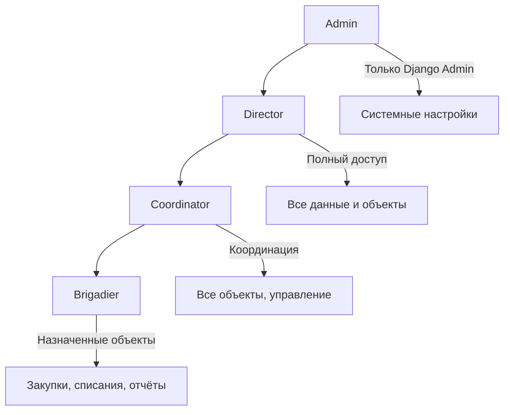
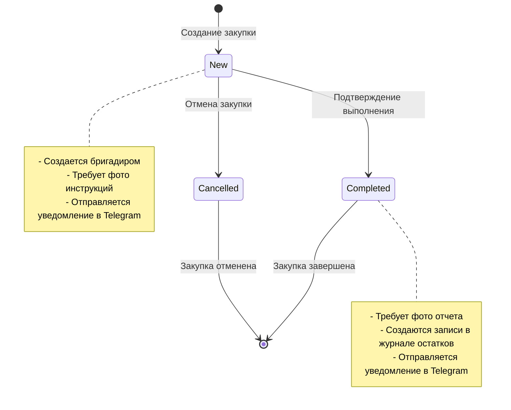

# Бизнес-логика ELOM

**Последнее обновление:** 27 ноября 2025

## Обзор бизнес-процессов

ELOM реализует комплексную систему управления строительными проектами с акцентом на контроль закупок, остатков материалов и отчетности. Система построена на принципах ролевой модели доступа и автоматизации бизнес-процессов.

## Роли пользователей и права доступа

### Иерархия ролей (обновлено ноябрь 2025)

> **Важно:** Роли `buyer` и `site_manager` удалены - их функции выполняет `brigadier`



### Детальное описание ролей

#### 1. Admin (Администратор)
**Права доступа:**
- Полный доступ ко всем данным и функциям
- Управление пользователями и ролями
- Настройка системы
- **Доступ только через Django Admin панель**

**Ограничения:**
- Нет ограничений по объектам
- Может изменять любые данные
- **Не отображается в списке сотрудников на фронтенде** (суперпользователи)

**Бизнес-функции:**
- Создание и управление пользователями
- Настройка системы уведомлений
- Управление справочниками
- Доступ к аудиту системы

#### 2. Director (Директор)
**Права доступа:**
- Доступ ко всем объектам
- Просмотр всех закупок и остатков
- Управление отчетами
- Назначение ответственных

**Ограничения:**
- Не может изменять системные настройки
- Не может управлять пользователями

**Бизнес-функции:**
- Стратегическое планирование
- Контроль выполнения проектов
- Анализ эффективности закупок
- Принятие решений по объектам

#### 3. Coordinator (Координатор)
**Права доступа:**
- Доступ к назначенным объектам
- Координация между бригадами
- Просмотр отчетов по объектам
- Управление расписанием работ

**Ограничения:**
- Только назначенные объекты
- Не может создавать закупки

**Бизнес-функции:**
- Планирование работ
- Координация между подрядчиками
- Контроль выполнения планов
- Отчетность перед руководством

#### 4. Brigadier (Бригадир)
**Права доступа:**
- Доступ к объектам, где бригадир является ответственным
- Создание и управление закупками
- Управление списаниями материалов
- Автоматическое назначение ответственным за объект при первом списании

**Ограничения:**
- Только объекты, где бригадир ответственный
- Не может изменять системные настройки
- Не может создавать списания для чужих объектов

**Бизнес-функции:**
- Планирование закупок материалов
- Контроль остатков на объекте
- Управление бригадой
- Отчетность о выполнении работ

**Автоматическое назначение ответственным:**
При создании списания на объекте без ответственного:
1. Бригадир автоматически становится ответственным за этот объект
2. Бригадир автоматически устанавливается как ответственный за списание
3. После этого только этот бригадир может создавать списания для данного объекта

#### 5-6. Buyer и Site Manager (УДАЛЕНЫ)

> **Важно (ноябрь 2025):** Роли `buyer` (Покупатель) и `site_manager` (Менеджер объекта) удалены из системы. Все их функции теперь выполняет роль `brigadier` (Бригадир).
>
> При миграции все существующие пользователи с ролями `buyer` и `site_manager` автоматически конвертированы в `brigadier`.

## Object-Scope ограничения

### Принцип работы
```python
def get_accessible_objects(self):
    """Получить объекты, к которым есть доступ"""
    if self.role in ("director", "admin", "coordinator"):
        # Полный доступ ко всем объектам
        return Object.objects.filter(is_active=True)
    else:
        # Доступ только к закрепленным объектам
        return self.assigned_objects.filter(is_active=True)
```

### Практическое применение
- **Admin/Director**: Видят все объекты в системе
- **Coordinator**: Видят все объекты для координации
- **Brigadier**: Видят только назначенные объекты

## Деактивация объектов (27 ноября 2025)

### Безопасное удаление объектов

При попытке удаления объекта, который имеет связанные записи (закупки, списания, движения остатков), объект **деактивируется** вместо удаления:

```python
def destroy(self, request, *args, **kwargs):
    instance = self.get_object()
    
    # Проверяем наличие связанных записей
    has_purchases = Purchase.objects.filter(object=instance).exists()
    has_writeoffs = WriteOff.objects.filter(object=instance).exists()
    has_snapshots = StockSnapshot.objects.filter(object=instance).exists()
    
    if has_purchases or has_writeoffs or has_snapshots:
        # Деактивируем объект вместо удаления
        instance.is_active = False
        instance.save(update_fields=['is_active'])
        return Response({
            "detail": f"Объект '{instance.name}' деактивирован",
            "action": "deactivated"
        }, status=status.HTTP_200_OK)
    else:
        # Удаляем объект, если нет связей
        self.perform_destroy(instance)
        return Response(status=status.HTTP_204_NO_CONTENT)
```

### Защита от операций с деактивированными объектами

Нельзя создавать закупки и списания для деактивированных объектов:

**Backend валидация:**
```python
# purchases/views.py
if object_obj and not object_obj.is_active:
    raise ValidationError({
        'object': 'Нельзя создать закупку для деактивированного объекта'
    })

# stock/views.py
if not site_object.is_active:
    raise ValidationError({
        'object': 'Нельзя создать списание для деактивированного объекта'
    })
```

**Frontend фильтрация:**
```typescript
// Деактивированные объекты скрыты в выпадающих списках
const objectOptions = computed(() => {
  return objects.value.filter((obj: any) => obj.is_active)
})
```

### UI для деактивированных объектов

- Кнопка "Удалить" скрыта для деактивированных объектов
- При деактивации показывается информационное уведомление
- Деактивированные объекты не отображаются в формах закупок и списаний

## Workflow закупок

### Жизненный цикл закупки



### Бизнес-правила закупок

#### 1. Создание закупки
**Кто может создавать:**
- Только пользователи с ролью `brigadier`
- Ответственный должен быть назначен на объект

**Обязательные поля:**
- Дата закупки
- Объект (с проверкой доступа)
- Поставщик
- Ответственный (только бригадир)
- Элементы закупки (материалы, количества, цены)

**Автоматические действия:**
- Генерация номера закупки (уникальный в пределах ответственного)
- Расчет общей суммы
- Отправка уведомления в Telegram
- Создание записей в журнале аудита

#### 2. Статусы закупок (обновлено 27 ноября 2025)

> **Ключевое правило:** Только закупки со статусом `completed` являются реальными поступлениями материалов!

**New (Новая):**
- Статус по умолчанию при создании
- Можно редактировать все поля
- Требует фото инструкций (опционально)
- ❌ **НЕ учитывается в остатках**
- ❌ **НЕ создает записи в StockSnapshot**

**Completed (Выполнено):**
- Устанавливается после получения материалов
- **Обязательно** требуются фото отчета
- ✅ **Создаются записи в журнале остатков (StockSnapshot)**
- ✅ **Материалы учитываются в остатках и доступны для списания**
- Закупка становится неизменяемой

**Cancelled (Отменена):**
- Устанавливается при отмене закупки
- Закупка становится неизменяемой
- ❌ **НЕ создаются записи в журнале остатков**
- ❌ **Если была выполнена ранее - записи StockSnapshot удаляются**

#### Синхронизация при смене статуса

При изменении статуса закупки автоматически синхронизируются записи StockSnapshot:

```python
@receiver(post_save, sender=Purchase)
def sync_ledger_on_status_change(sender, instance, created, **kwargs):
    if not created:  # Только при обновлении
        if instance.status == 'completed':
            # Создаем записи StockSnapshot для всех позиций
            for item in instance.items.all():
                BalanceCalculationService.create_ledger_entry_for_purchase_item(item)
        else:
            # Удаляем записи StockSnapshot
            StockSnapshot.objects.filter(
                source_type='purchase_item',
                source_id__in=instance.items.values_list('id', flat=True)
            ).delete()
```

#### Фильтрация материалов по статусу

Endpoint `by-object` возвращает только материалы из **выполненных** закупок:

```python
material_ids = PurchaseItem.objects.filter(
    purchase__object_id=object_id,
    purchase__status='completed',  # Только выполненные!
    material__isnull=False
).values_list('material_id', flat=True).distinct()
```

#### Отчёты по закупкам

По умолчанию отчёты включают только выполненные закупки. Для включения всех статусов можно передать параметр `?include_all_statuses=true`.

#### 3. Валидация закупок
```python
def clean(self):
    """Валидация модели Purchase"""
    super().clean()
    
    # Проверка роли ответственного
    if self.responsible and hasattr(self.responsible, 'profile'):
        if self.responsible.profile.role != 'brigadier':
            raise ValidationError({
                'responsible': 'Ответственным может быть только пользователь с ролью "Бригадир"'
            })
    
    # Проверка на фото отчета при статусе "completed"
    if self.status == 'completed':
        report_photos = self.photos.filter(type='report')
        if not report_photos.exists():
            raise ValidationError({
                'status': 'При статусе "Выполнено" обязательны фото отчета'
            })
```

## Unified Ledger Model (Журнал остатков)

### Принцип работы
Все движения материалов фиксируются в центральном журнале `StockSnapshot` с поддержкой:
- Приходов (положительные значения `quantity_signed`)
- Расходов (отрицательные значения `quantity_signed`)
- Конверсии единиц измерения
- Привязки к источникам движения

### Типы источников движения

#### 1. Purchase Item (Элемент закупки)
```python
# Автоматическое создание при создании PurchaseItem
@receiver(post_save, sender=PurchaseItem)
def create_ledger_entry_for_purchase_item(sender, instance, created, **kwargs):
    if created:
        StockSnapshot.objects.create(
            date=instance.purchase.date,
            object=instance.purchase.object,
            material=instance.material,
            unit=instance.unit,
            quantity_signed=instance.quantity,  # Положительное значение
            stage='delivery_fixed',
            source_type='purchase_item',
            source_id=instance.id,
            responsible=instance.purchase.responsible,
            comment=f"Приход из закупки #{instance.purchase.purchase_no}"
        )
```

#### 2. Write Off (Списание)
```python
# Автоматическое создание при создании WriteOff
@receiver(post_save, sender=WriteOff)
def create_ledger_entry_for_writeoff(sender, instance, created, **kwargs):
    if created:
        StockSnapshot.objects.create(
            date=instance.date,
            object=instance.object,
            material=instance.material,
            unit=instance.unit,
            quantity_signed=-instance.quantity,  # Отрицательное значение
            stage=instance.stage,
            source_type='writeoff',
            source_id=instance.id,
            responsible=instance.responsible,
            comment=instance.comment or f"Списание на этапе {instance.get_stage_display()}"
        )
```

### Фильтрация материалов по объектам в списаниях

#### Бизнес-логика фильтрации
Система реализует интеллектуальную фильтрацию материалов в форме списаний на основе выбранного объекта. Это обеспечивает:

1. **Контроль доступности материалов**: Пользователь может списать только те материалы, которые были закуплены для выбранного объекта
2. **Предотвращение ошибок**: Исключается возможность списания материалов, которых нет на объекте
3. **Улучшение UX**: Список материалов автоматически обновляется при смене объекта

#### API Endpoint для фильтрации
```python
# Backend: common/views.py
@action(detail=False, methods=["get"], url_path="by-object")
def by_object(self, request):
    """Получить материалы по объекту"""
    object_id = request.query_params.get('object_id')
    is_active = request.query_params.get('is_active', 'true').lower() == 'true'
    
    if not object_id:
        return Response({"detail": "object_id is required"}, status=400)
    
    # Получаем материалы, которые были закуплены для данного объекта
    from purchases.models import PurchaseItem
    
    material_ids = PurchaseItem.objects.filter(
        purchase__object_id=object_id,
        material__isnull=False
    ).values_list('material_id', flat=True).distinct()
    
    # Получаем материалы
    queryset = Material.objects.filter(
        id__in=material_ids,
        is_active=is_active
    ).select_related("category", "default_unit").order_by('name')
    
    serializer = MaterialLiteSerializer(queryset, many=True)
    return Response(serializer.data)
```

#### Frontend реализация
```typescript
// Materials Store
async getMaterialsByObject(objectId: number): Promise<Material[]> {
  try {
    const queryParams = {
      object_id: objectId,
      is_active: true
    }
    const queryString = buildQuery(queryParams)
    const { data } = await api.get<Material[]>(endpoints.materials.byObject + queryString)
    return data
  } catch (error: any) {
    console.error('Error getting materials by object:', error)
    return []
  }
}

// WriteOffForm - реактивная фильтрация
watch(() => formData.object, async (objectId) => {
  if (objectId) {
    await loadMaterialsByObject(objectId)
    // Сбрасываем выбранный материал при смене объекта
    formData.material = null
    formData.unit = 0
    selectedMaterialId.value = 0
  } else {
    filteredMaterials.value = []
    formData.material = null
    formData.unit = 0
    selectedMaterialId.value = 0
  }
}, { immediate: true })
```

#### Бизнес-правила фильтрации
1. **Источник данных**: Материалы фильтруются на основе записей в таблице `PurchaseItem`, где закупка связана с выбранным объектом
2. **Активность**: По умолчанию показываются только активные материалы (`is_active=true`)
3. **Сортировка**: Материалы сортируются по названию для удобства поиска
4. **Реактивность**: При смене объекта список материалов обновляется автоматически
5. **Сброс выбора**: При смене объекта сбрасываются выбранный материал и единица измерения
6. **Режим редактирования**: При редактировании существующего списания материалы загружаются для объекта из записи

### Этапы работ (Stages)
```python
STAGE_CHOICES = [
    ("acceptance", "Acceptance"),           # Приём объекта
    ("request", "Request"),                 # Заявка
    ("delivery_fixed", "Delivery Fixed"),   # Фактическая поставка
    ("post_rough", "Post Rough"),           # После черновых
    ("handover", "Handover"),               # Сдача
]
```

**Бизнес-логика этапов:**
- **Acceptance**: Приемка объекта в работу
- **Request**: Планирование и заявки на материалы
- **Delivery Fixed**: Фактическое поступление материалов
- **Post Rough**: Списания после черновых работ
- **Handover**: Списания при сдаче объекта

## Система валидации остатков

### Упрощенная валидация
Система валидации упрощена для повышения удобства использования. Удалена система `validation_warnings`, теперь отображается только актуальный остаток материала.

#### Отображение остатка в форме списаний
```vue
<!-- Актуальный остаток материала -->
<div v-if="formData.object && formData.material && currentBalance !== null" class="alert alert-info">
  <svg class="w-6 h-6 flex-shrink-0" fill="none" viewBox="0 0 24 24" stroke="currentColor">
    <path stroke-linecap="round" stroke-linejoin="round" stroke-width="2" d="M13 16h-1v-4h-1m1-4h.01M21 12a9 9 0 11-18 0 9 9 0 0118 0z" />
  </svg>
  <div class="text-sm">
    <div class="font-bold">Актуальный остаток материала</div>
    <div class="mt-1">
      <span class="font-mono">{{ currentBalance.toFixed(6) }}</span>
      <span class="ml-1">{{ unitCode }}</span>
    </div>
  </div>
</div>
```

### Базовая валидация
- **Обязательные поля**: Объект, материал, единица измерения, количество, этап, ответственный
- **Количество**: Должно быть больше 0
- **Остаток**: Отображается текущий остаток, но не блокирует списание
- **Единица измерения**: Автоматически подставляется из материала

## Система конверсии единиц измерения

### Принцип работы
```python
class UnitConversion(models.Model):
    from_unit = models.ForeignKey(Unit, related_name="conv_from")
    to_unit = models.ForeignKey(Unit, related_name="conv_to")
    factor = models.DecimalField(max_digits=18, decimal_places=6)
    
    class Meta:
        unique_together = ("from_unit", "to_unit")
```

### Формула конверсии
```
to_value = from_value * factor
```

### Примеры конверсий
- 1 тонна = 1000 кг (factor = 1000)
- 1 кубометр = 1000 литров (factor = 1000)
- 1 метр = 100 сантиметров (factor = 100)

### Smart Quantity система
```python
class SmartQuantity:
    """Умная система отображения количеств с конверсией"""
    
    def __init__(self, value, unit, original_value, original_unit):
        self.value = value
        self.unit = unit
        self.original_value = original_value
        self.original_unit = original_unit
        self.conversion_applied = value != original_value
    
    def get_display_value(self):
        """Возвращает значение для отображения"""
        if self.conversion_applied:
            return f"{self.value} {self.unit} (из {self.original_value} {self.original_unit})"
        return f"{self.value} {self.unit}"
```

## Система уведомлений

### Telegram уведомления

#### Настройка
```python
class TelegramSettings(models.Model):
    bot_token = models.CharField(max_length=256)
    chat_id = models.CharField(max_length=64)
    is_active = models.BooleanField(default=True)
```

#### Типы уведомлений

**1. Создание закупки:**
```python
@receiver(post_save, sender=Purchase)
def send_purchase_telegram_notification(sender, instance, created, **kwargs):
    if created:
        message = f"""
🛒 Новая закупка #{instance.purchase_no}
📅 Дата: {instance.date}
🏗️ Объект: {instance.object.name}
🏢 Поставщик: {instance.supplier.name}
👤 Ответственный: {instance.responsible.profile.user.get_full_name()}
💰 Сумма: {instance.total_amount} {instance.currency}
📝 Комментарий: {instance.comment or 'Нет'}
        """
        
        TelegramNotificationService.send_message(message)
```

**2. Изменение статуса закупки:**
```python
@receiver(post_save, sender=Purchase)
def send_status_change_notification(sender, instance, created, **kwargs):
    if not created and instance.status == 'completed':
        message = f"""
✅ Закупка выполнена #{instance.purchase_no}
🏗️ Объект: {instance.object.name}
📸 Фото отчета: {instance.photos.filter(type='report').count()} шт.
        """
        
        TelegramNotificationService.send_message(message)
```

**3. Создание объекта с фото:**
```python
@receiver(post_save, sender=Object)
def send_object_creation_notification(sender, instance, created, **kwargs):
    if created and instance.photos.exists():
        message = f"""
🏗️ Новый объект: {instance.name}
📍 Адрес: {instance.address}
👤 Ответственный: {instance.responsible.user.get_full_name()}
📸 Фото инструкций: {instance.photos.filter(type='instructions').count()} шт.
        """
        
        TelegramNotificationService.send_message_with_photos(message, instance.photos.all())
```

### Внутренние уведомления
```python
class Notification(models.Model):
    user = models.ForeignKey(User, on_delete=models.CASCADE)
    type = models.CharField(max_length=20, choices=[
        ('info', 'Информация'),
        ('warning', 'Предупреждение'),
        ('error', 'Ошибка'),
        ('success', 'Успех')
    ])
    title = models.CharField(max_length=200)
    message = models.TextField()
    read = models.BooleanField(default=False)
    related_type = models.CharField(max_length=20, choices=[
        ('purchase', 'Закупка'),
        ('object', 'Объект'),
        ('material', 'Материал'),
        ('stock', 'Остаток')
    ])
    related_id = models.PositiveIntegerField()
    created_at = models.DateTimeField(auto_now_add=True)
```

## Система отчетности

### Типы отчетов

#### 1. Отчет по объектам
**Назначение:** Анализ эффективности работы по объектам
**Параметры:**
- Период (дата от/до)
- Объекты (фильтр)
- Ответственные (фильтр)

**Метрики:**
- Количество закупок
- Общая сумма закупок
- Уникальные материалы
- Уникальные ответственные
- Даты первой и последней закупки

#### 2. Отчет по материалам
**Назначение:** Анализ использования материалов
**Параметры:**
- Период (дата от/до)
- Материалы (фильтр)
- Объекты (фильтр)

**Метрики:**
- Общее количество
- Общая сумма
- Средняя цена
- Минимальная цена
- Максимальная цена
- Количество закупок

#### 3. Отчет по ответственным
**Назначение:** Анализ работы ответственных лиц
**Параметры:**
- Период (дата от/до)
- Ответственные (фильтр)
- Объекты (фильтр)

**Метрики:**
- Количество закупок
- Общая сумма закупок
- Уникальные объекты
- Уникальные материалы

### Экспорт отчетов
- **Excel (.xlsx)**: Детализированные данные с форматированием
- **PDF**: Готовые к печати отчеты с графиками

## Система архивирования

### Принцип работы
```python
class ArchivePeriod(models.Model):
    month = models.CharField(max_length=7)  # YYYY-MM
    object = models.ForeignKey(Object, on_delete=models.CASCADE)
    closed_at = models.DateTimeField(auto_now_add=True)
    closed_by = models.ForeignKey(User, on_delete=models.PROTECT)
    is_closed = models.BooleanField(default=True)
```

### Бизнес-правила архивирования
- Архивирование происходит по месяцам
- Закрытый период нельзя изменять
- Архивированные данные доступны только для чтения
- Возможность повторного открытия периода (только для admin)

### Процесс архивирования
1. **Выбор объекта и месяца** - пользователь выбирает объект и месяц для архивирования
2. **Проверка прав доступа** - только director, admin, coordinator могут закрывать периоды
3. **Валидация параметров** - проверка корректности месяца (YYYY-MM) и существования объекта
4. **Проверка на дублирование** - период не должен быть уже закрыт
5. **Массовое архивирование данных**:
   - Все закупки за период: `Purchase.is_archived = True`
   - Все складские операции за период: `StockSnapshot.is_archived = True`
6. **Создание записи архива** - создание `ArchivePeriod` с метаданными
7. **Логирование в аудит** - запись операции в `AuditLog`

### Процесс открытия периода
1. **Проверка прав доступа** - только director, admin могут открывать периоды
2. **Поиск архивного периода** - проверка существования записи в архиве
3. **Массовое снятие архива**:
   - Все закупки за период: `Purchase.is_archived = False`
   - Все складские операции за период: `StockSnapshot.is_archived = False`
4. **Удаление записи архива** - удаление `ArchivePeriod`
5. **Логирование в аудит** - запись операции открытия

### Валидация и ограничения
- **Формат месяца**: YYYY-MM (например, "2024-01")
- **Проверка дублирования**: один объект не может иметь два закрытых периода за один месяц
- **Права доступа**: строгое разделение по ролям
- **Атомарность**: все операции выполняются в транзакции
- **Аудит**: все операции логируются с деталями

## Система аудита

### AuditLog модель
```python
class AuditLog(models.Model):
    ts = models.DateTimeField(auto_now_add=True)
    user = models.ForeignKey(User, on_delete=models.SET_NULL)
    action = models.CharField(max_length=32)  # create, update, delete
    model = models.CharField(max_length=64)   # Purchase, Material, etc.
    object_id = models.CharField(max_length=64)
    detail = models.TextField()  # JSON с изменениями
    ip = models.GenericIPAddressField()
```

### Автоматическое логирование
```python
@receiver(post_save, sender=Purchase)
def log_purchase_changes(sender, instance, created, **kwargs):
    action = 'create' if created else 'update'
    
    AuditLog.objects.create(
        user=get_current_user(),
        action=action,
        model='Purchase',
        object_id=str(instance.id),
        detail=json.dumps({
            'purchase_no': instance.purchase_no,
            'object': instance.object.name,
            'supplier': instance.supplier.name,
            'total_amount': str(instance.total_amount)
        }),
        ip=get_client_ip()
    )
```

## Бизнес-правила валидации

### Объекты
1. **Ответственный**: Должен иметь роль `brigadier`
2. **Обязательные поля**: Название, ответственный, ключевое лицо, контакты, дата начала
3. **Уникальность**: Название объекта должно быть уникальным

### Материалы
1. **SKU**: Должен быть уникальным (если указан)
2. **Единица измерения**: Обязательна
3. **Категория**: Опциональна, но рекомендуется

### Закупки
1. **Ответственный**: Только бригадиры
2. **Статус "Completed"**: Обязательны фото отчета
3. **Номер закупки**: Уникален в пределах ответственного
4. **Сумма**: Автоматически рассчитывается из элементов

### Списания
1. **Остатки**: Проверка достаточности остатков
2. **Отрицательные остатки**: Запрещены для определенных ролей/этапов
3. **Единицы измерения**: Поддержка конверсии

### Пользователи
1. **Телефон**: Обязателен для всех ролей кроме admin/director
2. **Роли**: Ограниченный набор ролей
3. **Объекты**: Ограничение доступа по назначенным объектам

## Система Telegram уведомлений

### Обзор системы
ELOM интегрирован с Telegram Bot API для автоматической отправки уведомлений о ключевых событиях в закупках. Система работает через Django сигналы и обеспечивает оперативное информирование всех участников процесса.

### Модели данных
- **TelegramSettings**: Настройки бота (токен, chat_id, активность)
- **TelegramNotification**: Журнал всех отправленных уведомлений

### Типы уведомлений
1. **Создание закупки** (`created`) - 🆕
2. **Изменение статуса** (`status_changed`) - 🔄  
3. **Добавление фото** (`photo_added`) - 📸

### Содержание сообщений
Каждое уведомление содержит:
- **Статус** закупки (на русском языке)
- **Ответственный** (пользователь с ролью бригадир)
- **Объект** (название объекта)
- **Поставщик** (название поставщика)
- **Номер закупки** (purchase_no)
- **Локация** (location_url из объекта, если есть)
- **Комментарий** (если есть)
- **Дата** закупки
- **Сумма** с валютой

### Автоматические процессы
- При создании закупки → уведомление о создании
- При изменении статуса → уведомление о смене статуса
- При статусе "completed" → прикрепляются фото отчета
- При добавлении фото → уведомление с фото

### Интерактивные кнопки
- **📍 Открыть на карте** - кнопка с URL для перехода к локации объекта
- **📋 Детали закупки** - кнопка для получения дополнительной информации

### Валидация фото
- **Статус "completed"**: Обязательны фото типа `report`
- **Фотоинструкции**: Опционально обязательны при создании (настраивается)
- **Типы фото**: `instructions` (инструкции), `report` (отчет)
- **Максимум фото**: 5 на уведомление

### Настройка системы
1. Создание бота через @BotFather
2. Получение токена и chat_id
3. Настройка в Django Admin
4. Активация через `is_active = True`
5. Настройка валидации фотоинструкций через `REQUIRE_PURCHASE_INSTRUCTIONS`

### API для валидации
- **GET /purchases/{id}/validate/** - проверка валидности закупки
- Возвращает информацию о фотоинструкциях и фотоотчетах
- Показывает предупреждения и ошибки валидации

## Интеграционные точки

### Внешние системы
1. **Telegram Bot API**: Уведомления ✅
2. **Email**: Системные уведомления (планируется)
3. **SMS**: Критические уведомления (планируется)
4. **ERP системы**: Импорт/экспорт данных (планируется)

### API интеграции
1. **REST API**: Полный доступ к данным
2. **Webhooks**: Уведомления о событиях (планируется)
3. **GraphQL**: Альтернативный API (планируется)

## Масштабирование и производительность

### Оптимизация запросов
- Использование `select_related` и `prefetch_related`
- Индексы базы данных для часто используемых полей
- Кэширование часто используемых данных

### Партиционирование
- По датам для больших таблиц
- По объектам для распределения нагрузки
- По пользователям для изоляции данных

### Мониторинг
- Логирование производительности
- Метрики использования
- Алерты при превышении лимитов

## Система пагинации и управления данными

### Архитектура пагинации

ELOM использует единообразную систему пагинации через базовый store `createBaseStore`, который обеспечивает консистентное поведение во всех списках данных.

#### Базовый store (createBaseStore)

```typescript
export function createBaseStore<T extends Record<string, any>, C, U>(
  config: BaseStoreConfig<T, C, U>
) {
  const store = defineStore(config.entityName, () => {
    // State
    const items = ref<T[]>([])
    const current = ref<T | null>(null)
    const loading = ref(false)
    const error = ref<string | null>(null)
    const pagination = ref<PaginationState>({
      count: 0,
      page: 1,
      pageSize: 20,
      next: null,
      previous: null
    })
    const filters = ref<BaseFilters>({
      search: '',
      ordering: 'id'
    })

    // CRUD Actions
    const fetchList = async (params?: any) => {
      // ... реализация с пагинацией
    }

    // Utility methods
    const setPageSize = async (size: number) => {
      pagination.value.pageSize = size
      pagination.value.page = 1
      await fetchList()
    }

    const setPage = async (page: number) => {
      pagination.value.page = page
      await fetchList()
    }

    const setFilters = async (newFilters: Partial<BaseFilters>) => {
      Object.assign(filters.value, newFilters)
      pagination.value.page = 1 // Сбрасываем на первую страницу при изменении фильтров
      await fetchList()
    }

    const resetFilters = async () => {
      filters.value = {
        search: '',
        ordering: 'id'
      }
      pagination.value.page = 1 // Сбрасываем на первую страницу при сбросе фильтров
      await fetchList()
    }

    return {
      // State
      items, current, loading, error, pagination, filters,
      // CRUD Actions
      fetchList, fetchOne, create, update, delete: deleteItem,
      // Utility methods
      setCurrent, setFilters, resetFilters, clearError, setPageSize, setPage
    }
  })
  
  return store()
}
```

#### Stores с единообразной пагинацией

Все основные stores используют `createBaseStore`:

1. **Закупки** (`usePurchasesStore`)
2. **Материалы** (`useMaterialsStore`) 
3. **Поставщики** (`useSuppliersStore`)
4. **Сотрудники** (`useEmployeesStore`)
5. **Объекты** (`useObjectsStore`)
6. **Списания** (`useWriteOffsStore`)
7. **Единицы измерения** (`useUnitsStore`)
8. **Движения остатков** (`useStockSnapshotsStore`)
9. **Категории материалов** (`useMaterialCategoriesStore`)
10. **Остатки по объектам** (`useBalancesStore`)

#### Расширенные stores

Некоторые stores расширяют базовый функционал:

**Materials Store** - добавляет фильтры по категориям, SKU, названию:
```typescript
const extendedFilters = {
  search: '',
  name: '',
  sku: '',
  category: '',
  ordering: 'name'
}
```

**Balances Store** - обрабатывает специфичную структуру API остатков:
```typescript
// Flattening данных для табличного отображения
const flattenedData: MaterialBalance[] = []
if (response.data.objects) {
  response.data.objects.forEach((obj: any) => {
    obj.materials.forEach((material: any) => {
      flattenedData.push({
        material_id: material.material_id,
        material_name: material.material_name,
        // ... другие поля
      } as MaterialBalance)
    })
  })
}
```

### Преимущества единообразной пагинации

1. **Консистентность**: Все списки ведут себя одинаково
2. **Простота поддержки**: Один код для всех stores
3. **Типобезопасность**: Строгая типизация TypeScript
4. **Производительность**: Оптимизированные запросы к API
5. **UX**: Единообразный пользовательский опыт

### Компонент ModernPagination

```vue
<template>
  <div v-if="totalPages > 1" class="modern-pagination-container">
    <!-- Информация о пагинации -->
    <div class="pagination-info">
      <span class="pagination-stats">
        Показано {{ startItem }}-{{ endItem }} из {{ totalItems }} записей
      </span>
    </div>

    <!-- Навигация по страницам -->
    <div class="pagination-nav">
      <!-- Кнопки навигации -->
      <button @click="goToPage(1)" :disabled="currentPage === 1">Первая</button>
      <button @click="goToPage(currentPage - 1)" :disabled="currentPage === 1">Предыдущая</button>
      
      <!-- Номера страниц -->
      <div class="pagination-pages">
        <button v-for="page in visiblePages" :key="page" 
                @click="goToPage(page)" 
                :class="{ 'pagination-btn-active': page === currentPage }">
          {{ page }}
        </button>
      </div>
      
      <button @click="goToPage(currentPage + 1)" :disabled="currentPage === totalPages">Следующая</button>
      <button @click="goToPage(totalPages)" :disabled="currentPage === totalPages">Последняя</button>
    </div>
  </div>
</template>
```

### Интеграция с GenericList

```vue
<template>
  <div class="list-container">
    <!-- GenericList Component -->
    <GenericList
      :store="store"
      :config="listConfig"
      @create="openCreateModal"
      @action="handleAction"
      @export="handleExport"
    />
  </div>
</template>

<script setup lang="ts">
// Store автоматически предоставляет методы пагинации
const store = useMaterialsStore

// GenericList автоматически использует:
// - store.setPage() для переключения страниц
// - store.setPageSize() для изменения размера страницы
// - store.setFilters() для фильтрации
// - store.resetFilters() для сброса фильтров
</script>
```

### Бизнес-правила пагинации

1. **Размер страницы по умолчанию**: 20 записей
2. **Сброс страницы**: При изменении фильтров страница сбрасывается на 1
3. **Обработка ошибок**: При ошибке 404 (неправильная страница) автоматический переход на страницу 1
4. **Кэширование**: Данные кэшируются в store для быстрого доступа
5. **Загрузка**: Показывается индикатор загрузки во время запросов

