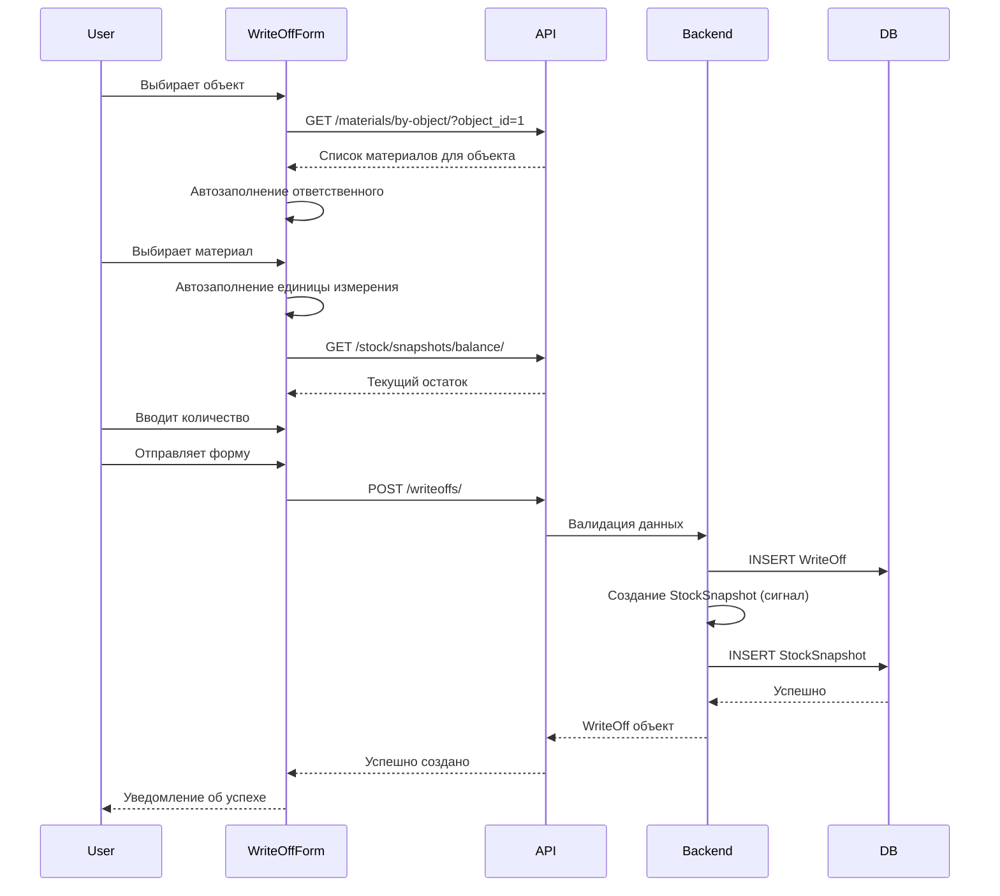

# Система списаний (WriteOff) - Полная документация

## Обзор

Система списаний материалов - это полнофункциональный модуль для учета расхода материалов на строительных объектах. Включает автоматическое формирование записей в журнале движений, умное автозаполнение полей форм и упрощенный интерфейс без избыточных предупреждений.

---

## Backend реализация

### Модель WriteOff

```python
class WriteOff(models.Model):
    """
    Модель списаний материалов согласно Unified Ledger Model v1.0
    """
    STAGE_CHOICES = [
        ("acceptance", "Acceptance"),           # Приём объекта
        ("request", "Request"),                 # Заявка
        ("delivery_fixed", "Delivery Fixed"),   # Фактическая поставка
        ("post_rough", "Post Rough"),           # После черновых
        ("handover", "Handover"),               # Сдача
    ]
    
    date = models.DateField(help_text="Дата списания")
    object = models.ForeignKey(Object, on_delete=models.PROTECT, help_text="Объект")
    material = models.ForeignKey(Material, on_delete=models.SET_NULL, null=True, blank=True, help_text="Материал")
    unit = models.ForeignKey(Unit, on_delete=models.PROTECT, help_text="Единица измерения")
    quantity = models.DecimalField(
        max_digits=18, decimal_places=6, 
        validators=[MinValueValidator(Decimal('0.000001'))],
        help_text="Количество к списанию"
    )
    stage = models.CharField(max_length=32, choices=STAGE_CHOICES, help_text="Этап работ")
    responsible = models.ForeignKey(User, on_delete=models.PROTECT, help_text="Ответственный")
    comment = models.TextField(blank=True, default="", help_text="Комментарий")
    is_archived = models.BooleanField(default=False, help_text="Архивировано")
    created_at = models.DateTimeField(auto_now_add=True)
    updated_at = models.DateTimeField(auto_now=True)

    class Meta:
        indexes = [
            models.Index(fields=["date"]),
            models.Index(fields=["object", "material", "date"]),
            models.Index(fields=["stage"]),
            models.Index(fields=["responsible"]),
        ]
        ordering = ["-date", "-created_at"]
```

### Валидация

```python
def clean(self):
    """Валидация данных списания"""
    # Проверяем, что количество положительное
    if self.quantity <= 0:
        raise ValidationError({"quantity": ["Количество для списания должно быть больше 0"]})
```

**Упрощенная валидация:**
- ✅ Проверка на положительное количество
- ❌ Удалена проверка остатков через `StockValidationService`
- ❌ Удалены предупреждения о низких/отрицательных остатках
- ❌ Удален файл `validation.py`

### Автоматическое формирование записей в журнале

```python
# stock/signals.py
@receiver(post_save, sender=WriteOff)
def create_ledger_entry_for_writeoff(sender, instance, created, **kwargs):
    """Создать или обновить запись в журнале движений"""
    try:
        with transaction.atomic():
            if created:
                BalanceCalculationService.create_ledger_entry_for_writeoff(instance)
            else:
                BalanceCalculationService.update_ledger_entry_for_writeoff(instance)
    except Exception as e:
        if created:
            instance.delete()
        raise e

@receiver(post_delete, sender=WriteOff)
def delete_ledger_entry_for_writeoff(sender, instance, **kwargs):
    """Удалить запись в журнале движений при удалении списания"""
    BalanceCalculationService.delete_ledger_entry_for_writeoff(instance)
```

### API Serializer

```python
class WriteOffSerializer(serializers.ModelSerializer):
    """Сериализатор для списаний материалов"""
    object_name = serializers.CharField(source="object.name", read_only=True)
    material_name = serializers.SerializerMethodField()
    unit_code = serializers.CharField(source="unit.code", read_only=True)
    smart_quantity = serializers.SerializerMethodField()
    current_balance = serializers.SerializerMethodField()

    class Meta:
        model = WriteOff
        fields = (
            "id", "date", "object", "object_name", "material", "material_name",
            "unit", "unit_code", "quantity", "stage", "responsible",
            "comment", "is_archived", "current_balance", "smart_quantity",
            "created_at", "updated_at"
        )
```

---

## Frontend реализация

### WriteOffForm компонент

Полнофункциональная форма списаний с использованием нативных HTML элементов и Daisy UI стилей.

#### Ключевые особенности:

1. **Автозаполнение материалов по объекту**
   ```typescript
   async function loadMaterialsByObject(objectId: number) {
     if (!objectId) {
       materialOptions.value = [{ value: 0, label: '— выберите материал —' }]
       return
     }
     
     materialsLoading.value = true
     try {
       const materials = await getMaterialsByObject(objectId)
       materialOptions.value = [
         { value: 0, label: '— выберите материал —' },
         ...materials.map((m: Material) => ({ value: m.id, label: m.name }))
       ]
     } finally {
       materialsLoading.value = false
     }
   }
   ```

2. **Автозаполнение единицы измерения**
   ```typescript
   function autoFillUnit(materialId: number | null) {
     if (userModifiedFields.value.unit) return
     if (!materialId) {
       formData.value.unit = 0
       return
     }
     
     const material = materialsStore.items.find((m: Material) => m.id === materialId)
     if (material && material.default_unit) {
       formData.value.unit = material.default_unit
     } else {
       formData.value.unit = 0
     }
   }
   ```

3. **Автозаполнение ответственного**
   ```typescript
   async function loadEmployeesByObject(objectId: number | null) {
     if (!objectId) {
       responsibleOptions.value = brigadiersOptions
       return
     }
     
     const object = objectsStore.items.find((obj: SiteObject) => obj.id === objectId)
     const objectResponsibleId = object?.responsible
     
     let responsibleList = [...brigadiersOptions]
     
     // Если ответственный объекта не в списке бригадиров, добавляем его
     if (objectResponsibleId) {
       const isInList = responsibleList.some(emp => emp.value === objectResponsibleId)
       if (!isInList) {
         const objectResponsible = employeesStore.items.find(
           (emp: Employee) => emp.id === objectResponsibleId
         )
         if (objectResponsible) {
           responsibleList.push({
             value: objectResponsible.id,
             label: `${objectResponsible.username} (ответственный за объект)`
           })
         }
       }
       
       // Автозаполнение ответственного
       if (!userModifiedFields.value.responsible) {
         formData.value.responsible = objectResponsibleId
       }
     }
     
     responsibleOptions.value = responsibleList
   }
   ```

4. **Отслеживание пользовательских изменений**
   ```typescript
   const userModifiedFields = ref({
     material: false,
     unit: false,
     responsible: false
   })
   
   function onMaterialChange(event: Event) {
     userModifiedFields.value.material = true
     clearErrors()
   }
   ```

5. **Загрузка и отображение актуального остатка**
   ```typescript
   const loadCurrentBalance = async () => {
     if (!formData.value.object || !formData.value.material) {
       currentBalance.value = 0
       return
     }

     try {
       const { data } = await api.get(endpoints.stockSnapshots.balance, {
         params: {
           object_id: formData.value.object,
           material_id: formData.value.material,
           date: formData.value.date
         }
       })
       currentBalance.value = parseFloat(data.current_balance || 0)
     } catch (error) {
       console.error('Error loading current balance:', error)
       currentBalance.value = 0
     }
   }
   ```

6. **UI для отображения остатка**
   ```vue
   <div v-if="formData.object && formData.material && currentBalance !== null" 
        class="alert alert-info">
     <svg class="w-6 h-6 flex-shrink-0" fill="none" viewBox="0 0 24 24" stroke="currentColor">
       <path stroke-linecap="round" stroke-linejoin="round" stroke-width="2" 
             d="M13 16h-1v-4h-1m1-4h.01M21 12a9 9 0 11-18 0 9 9 0 0118 0z" />
     </svg>
     <div class="text-sm">
       <div class="font-bold">Актуальный остаток материала</div>
       <div class="mt-1">
         <span class="font-mono">{{ currentBalance.toFixed(6) }}</span>
         <span class="ml-1">{{ unitCode }}</span>
       </div>
     </div>
   </div>
   ```

### Структура формы

```vue
<template>
  <Modal :model-value="isOpen" @close="closeModal">
    <form @submit.prevent="handleSubmit">
      <!-- Дата -->
      <input v-model="formData.date" type="date" required />
      
      <!-- Объект -->
      <select v-model="formData.object" @change="onObjectChange" required>
        <option v-for="obj in objectOptions" :value="obj.value">
          {{ obj.label }}
        </option>
      </select>
      
      <!-- Материал с фильтрацией по остаткам -->
      <MaterialSearchSelect
        v-model="formData.material"
        placeholder="— выберите материал —"
        :object-id="formData.object || null"
        :date="formData.date || null"
        :filter-by-balance="true"
        :disabled="!formData.object || materialsLoading"
        @change="onMaterialChange"
      />
      
      <!-- Единица измерения -->
      <select v-model="formData.unit" @change="onUnitChange"
              :disabled="isUnitDisabled" required>
        <option v-for="unit in unitOptions" :value="unit.value">
          {{ unit.label }}
        </option>
      </select>
      
      <!-- Количество -->
      <input v-model="formData.quantity" type="number" 
             step="0.000001" min="0.000001" required />
      
      <!-- Этап -->
      <select v-model="formData.stage" required>
        <option value="acceptance">Приемка</option>
        <option value="request">Заявка</option>
        <option value="delivery_fixed">Доставка</option>
        <option value="post_rough">После черновых</option>
        <option value="handover">Сдача</option>
      </select>
      
      <!-- Ответственный -->
      <select v-model="formData.responsible" @change="onResponsibleChange" required>
        <option v-for="emp in responsibleOptions" :value="emp.value">
          {{ emp.label }}
        </option>
      </select>
      
      <!-- Комментарий -->
      <textarea v-model="formData.comment" rows="3"></textarea>
      
      <!-- Актуальный остаток -->
      <div v-if="currentBalance !== null" class="alert alert-info">
        <!-- ... -->
      </div>
      
      <!-- Кнопки -->
      <button type="submit" :disabled="loading">
        {{ props.initial ? 'Обновить' : 'Создать' }}
      </button>
    </form>
  </Modal>
</template>
```

### WriteOffList компонент

```vue
<template>
  <GenericList
    :store="writeOffsStore"
    :config="listConfig"
    @create="handleCreate"
    @action="handleAction"
  >
    <!-- Кастомные колонки -->
    <template #column-quantity="{ item, value }">
      <div class="text-right">
        <span class="font-mono">{{ formatQuantity(value) }}</span>
        <span class="text-sm ml-1">{{ item.unit_code }}</span>
      </div>
    </template>
    
    <template #column-current_balance="{ item, value }">
      <div class="text-right">
        <span class="font-mono font-semibold text-green-600">
          {{ formatQuantity(value) }}
        </span>
        <span class="text-sm ml-1">{{ item.unit_code }}</span>
      </div>
    </template>
  </GenericList>
  
  <!-- Форма списания -->
  <WriteOffForm
    :is-open="modalOpen"
    :initial="editingWriteOff"
    @close="modalOpen = false"
    @success="onWriteOffSaved"
  />
</template>
```

### WriteOffCard компонент (мобильная карточка)

```vue
<template>
  <div class="card bg-base-100 shadow-xl">
    <div class="card-body">
      <h2 class="card-title">{{ writeOff.material_name }}</h2>
      
      <div class="grid grid-cols-2 gap-2 text-sm">
        <div>
          <span class="text-gray-500">Объект:</span>
          <span class="font-medium">{{ writeOff.object_name }}</span>
        </div>
        <div>
          <span class="text-gray-500">Количество:</span>
          <span class="font-medium">
            {{ writeOff.quantity }} {{ writeOff.unit_code }}
          </span>
        </div>
        <div>
          <span class="text-gray-500">Дата:</span>
          <span class="font-medium">{{ formatDate(writeOff.date) }}</span>
        </div>
        <div>
          <span class="text-gray-500">Этап:</span>
          <span class="badge badge-outline">
            {{ getStageDisplayName(writeOff.stage) }}
          </span>
        </div>
        <div>
          <span class="text-gray-500">Ответственный:</span>
          <span class="font-medium">{{ writeOff.responsible_name }}</span>
        </div>
        <div>
          <span class="text-gray-500">Остаток:</span>
          <span class="font-medium">
            {{ writeOff.current_balance }} {{ writeOff.unit_code }}
          </span>
        </div>
      </div>
      
      <div v-if="writeOff.comment">
        <span class="text-gray-500">Комментарий:</span>
        <span class="font-medium">{{ writeOff.comment }}</span>
      </div>
    </div>
  </div>
</template>
```

---

## API интеграция

### Endpoints

```
GET    /api/v1/writeoffs/              - Список списаний
POST   /api/v1/writeoffs/              - Создание списания
GET    /api/v1/writeoffs/{id}/         - Получение списания
PUT    /api/v1/writeoffs/{id}/         - Обновление списания
DELETE /api/v1/writeoffs/{id}/         - Удаление списания
```

### Вспомогательные endpoints

```
GET /api/v1/materials/by-object/?object_id={id}&is_active=true
    - Получение материалов для объекта

GET /api/v1/stock/snapshots/balance/?object_id={id}&material_id={id}&date={date}
    - Получение текущего остатка материала

GET /api/v1/stock/snapshots/by-objects/?object_id={id}&date={date}
    - Получение остатков всех материалов для объекта (для фильтрации)
```

### Фильтрация материалов по остаткам

В форме списаний реализована автоматическая фильтрация материалов при поиске. Компонент `MaterialSearchSelect` поддерживает фильтрацию по остаткам:

**Как это работает:**
1. При вводе названия материала (2+ символа) выполняется поиск
2. Если включена фильтрация (`filterByBalance=true`) и указаны `objectId` и `date`:
   - Выполняется запрос к `/stock/snapshots/by-objects/` для получения остатков
   - Результаты поиска фильтруются, оставляя только материалы с `current_balance > 0`
3. Пользователь видит только доступные материалы

**Преимущества:**
- Снижается вероятность ошибок при выборе материалов без остатков
- Улучшается UX при работе с формой
- Автоматическая проверка наличия материалов

### Типы данных

```typescript
export interface WriteOff {
  id: number;
  date: string;
  object: number;
  object_name: string;
  material: number;
  material_name: string;
  unit: number;
  unit_code: string;
  quantity: string; // decimal as string
  stage: Stage;
  responsible: number;
  responsible_name?: string;
  comment?: string;
  is_archived: boolean;
  current_balance: string; // decimal as string
  smart_quantity: SmartQuantity;
  created_at: string;
  updated_at: string;
}

export interface WriteOffCreateRequest {
  date: string;
  object: number;
  material: number | null; // nullable
  unit: number;
  quantity: string; // decimal as string
  stage: Stage;
  responsible: number;
  comment?: string;
}
```

---

## Бизнес-логика

### Workflow списания



### Правила автозаполнения

#### 1. При выборе объекта:
- ✅ Загружаются материалы для этого объекта
- ✅ Автоматически выбирается ответственный за объект (если не изменен вручную)
- ✅ Добавляется ответственный в список, если его нет
- ✅ Сбрасываются поля "Материал" и "Единица измерения" (если не изменены вручную)

#### 2. При выборе материала:
- ✅ Автоматически подставляется единица измерения из `material.default_unit`
- ✅ Поле "Единица измерения" блокируется, если у материала есть `default_unit`
- ✅ Загружается текущий остаток материала на объекте

#### 3. При ручном изменении полей:
- ✅ Устанавливается флаг `userModifiedFields` для этого поля
- ✅ Автозаполнение отключается для измененных полей
- ✅ Очищаются ошибки валидации для поля

### Режим редактирования

#### Загрузка данных:
```typescript
async function initializeForm() {
  if (!props.initial) return
  
  // Временно блокируем автозаполнение
  const tempUserModified = { ...userModifiedFields.value }
  userModifiedFields.value = { material: true, unit: true, responsible: true }
  
  // Загружаем данные формы
  Object.assign(formData.value, {
    date: props.initial.date,
    object: props.initial.object,
    material: props.initial.material,
    unit: props.initial.unit,
    quantity: props.initial.quantity,
    stage: props.initial.stage,
    responsible: props.initial.responsible,
    comment: props.initial.comment || ''
  })
  
  // Загружаем материалы и сотрудников для объекта
  await loadMaterialsByObject(props.initial.object)
  await loadEmployeesByObject(props.initial.object)
  
  // Восстанавливаем флаги
  userModifiedFields.value = tempUserModified
  
  // Загружаем остаток
  await loadCurrentBalance()
}
```

#### Обработка недоступных материалов:
- Если материал из записи недоступен для объекта, он добавляется в список с меткой "(недоступен для объекта)"
- Если ответственный не является бригадиром, он добавляется в список с меткой "(текущий ответственный)"

---

## Удаленные компоненты

### ❌ Система validation_warnings

**Удалено из backend:**
- `stock/validation.py` - весь файл
- `StockValidationService` - класс
- `get_validation_warnings()` - метод
- `validate_writeoff()` - метод с предупреждениями
- Импорты в `stock/models.py`

**Удалено из frontend:**
- `validation_warnings: string[]` - поле в типах
- `validationWarnings` - ref в компонентах
- `generateWarnings()` - функция
- UI блоки с предупреждениями
- `getProjectedBalance()` - расчет баланса после списания

**Удалено из serializers:**
- `validation_warnings = SerializerMethodField()`
- `get_validation_warnings()` метод

### ❌ Расчет "После списания"

Удалены:
- Расчет прогнозируемого остатка
- UI блоки с отображением остатка после операции
- Логика для режима создания vs редактирования

### ✅ Что осталось

Только актуальный остаток:
```vue
<div class="alert alert-info">
  <div class="font-bold">Актуальный остаток материала</div>
  <div class="mt-1">
    <span class="font-mono">{{ currentBalance.toFixed(6) }}</span>
    <span class="ml-1">{{ unitCode }}</span>
  </div>
</div>
```

---

## Store реализация

### WriteOffsStore

```typescript
export const useWriteOffsStore = createBaseStore<
  WriteOff, 
  WriteOffCreateRequest, 
  WriteOffUpdateRequest
>({
  endpoint: endpoints.writeOffs,
  entityName: 'списание',
  entityNamePlural: 'списания'
})
```

### Дополнительные геттеры

```typescript
export const getByStage = (stage: string) => {
  return useWriteOffsStore.items.filter((item: WriteOff) => item.stage === stage)
}

export const getByObject = (objectId: number) => {
  return useWriteOffsStore.items.filter((item: WriteOff) => item.object === objectId)
}

export const getByMaterial = (materialId: number) => {
  return useWriteOffsStore.items.filter((item: WriteOff) => item.material === materialId)
}

export const getByResponsible = (responsibleId: number) => {
  return useWriteOffsStore.items.filter((item: WriteOff) => item.responsible === responsibleId)
}
```

### Статистика

```typescript
export const totalQuantity = computed(() =>
  useWriteOffsStore.items.reduce(
    (sum: number, item: WriteOff) => sum + parseFloat(item.quantity), 
    0
  )
)

export const stageStats = computed(() => {
  const stats: Record<string, { count: number; quantity: number }> = {}
  
  useWriteOffsStore.items.forEach((item: WriteOff) => {
    if (!stats[item.stage]) {
      stats[item.stage] = { count: 0, quantity: 0 }
    }
    stats[item.stage].count += 1
    stats[item.stage].quantity += parseFloat(item.quantity)
  })
  
  return stats
})
```

---

## Интеграция с журналом движений

### Автоматическое создание записей

При создании списания автоматически создается запись в `StockSnapshot`:

```python
StockSnapshot.objects.create(
    date=writeoff.date,
    object=writeoff.object,
    material=writeoff.material,
    unit=writeoff.unit,
    quantity_signed=-writeoff.quantity,  # Отрицательное значение для расхода
    stage=writeoff.stage,
    source_type='writeoff',
    source_id=writeoff.id,
    responsible=writeoff.responsible,
    comment=writeoff.comment or f"Списание на этапе {writeoff.get_stage_display()}"
)
```

### Обновление и удаление

- **При обновлении**: Существующая запись в `StockSnapshot` обновляется
- **При удалении**: Запись в `StockSnapshot` удаляется автоматически

---

## Примеры использования

### Создание списания через API

```http
POST /api/v1/writeoffs/
Content-Type: application/json
Authorization: Bearer <token>

{
  "date": "2024-10-08",
  "object": 1,
  "material": 5,
  "unit": 2,
  "quantity": "100.500000",
  "stage": "post_rough",
  "responsible": 3,
  "comment": "Списание после черновых работ"
}
```

### Ответ API

```json
{
  "id": 15,
  "date": "2024-10-08",
  "object": 1,
  "object_name": "ЖК Солнечный",
  "material": 5,
  "material_name": "Цемент М400",
  "unit": 2,
  "unit_code": "кг",
  "quantity": "100.500000",
  "stage": "post_rough",
  "responsible": 3,
  "responsible_name": "Иван Иванов",
  "comment": "Списание после черновых работ",
  "is_archived": false,
  "current_balance": "250.750000",
  "smart_quantity": {
    "value": 100.5,
    "unit": "кг",
    "original_value": 100.5,
    "original_unit": "кг",
    "display_value": 100.5,
    "display_unit": "кг",
    "conversion_applied": false
  },
  "created_at": "2024-10-08T10:30:00Z",
  "updated_at": "2024-10-08T10:30:00Z"
}
```

---

## Преимущества реализации

### 1. Упрощенный интерфейс
- ✅ Нет избыточных предупреждений
- ✅ Только актуальная информация (остаток)
- ✅ Быстрый ввод данных
- ✅ Минимум отвлекающих элементов

### 2. Умное автозаполнение
- ✅ Материалы фильтруются по объекту
- ✅ Единица измерения подставляется автоматически
- ✅ Ответственный выбирается из объекта
- ✅ Отслеживание ручных изменений

### 3. Автоматизация
- ✅ Автоматическое формирование записей в журнале
- ✅ Конверсия единиц измерения
- ✅ Расчет текущего остатка
- ✅ Валидация на backend

### 4. Безопасность
- ✅ Валидация обязательных полей
- ✅ Проверка прав доступа
- ✅ Аудит всех операций
- ✅ Защита от некорректных данных

---

## Статус

✅ **Полностью реализовано и готово к использованию**

**Реализованные функции:**
- Backend модель WriteOff
- API endpoints
- Frontend форма с автозаполнением
- Мобильная карточка
- Интеграция с журналом движений
- Store для управления данными
- Обработка ошибок
- Валидация данных

**Упрощения:**
- Удалены все предупреждения
- Удалена система StockValidationService
- Упрощена валидация
- Улучшен UX

**Готово к продакшену! 🚀**


